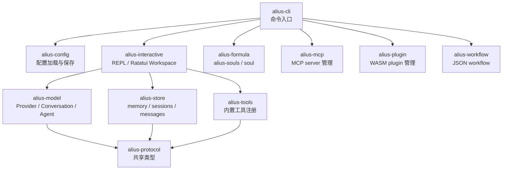
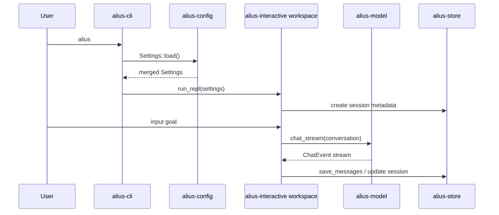
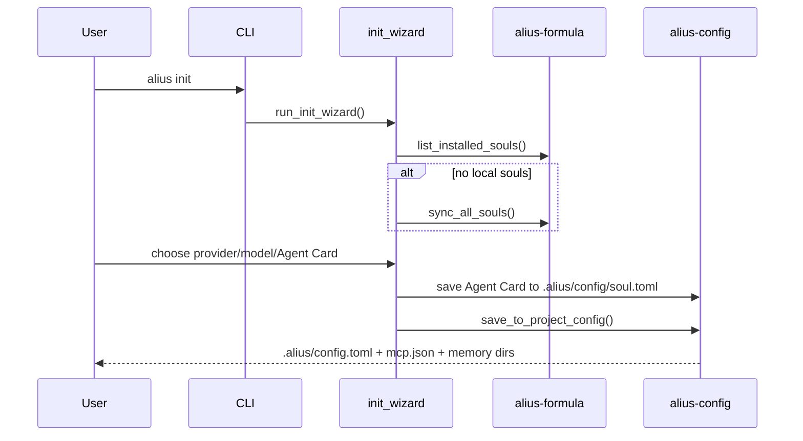

# 02. 系统架构

更新时间: 2026-06-04 22:10

## 分层架构

## 数据流主线

默认交互路径:

项目初始化路径:

## Crate 间边界

### `alius-cli`

只负责:

- 解析命令。
- 加载配置。
- 设置 locale。
- 调用对应 crate 的入口函数。

它不应承载 UI 状态、模型 provider 细节、session 文件布局或 tool 实现。

### `alius-config`

只负责配置结构和解析顺序:

1. 内嵌默认 TOML。
2. 用户级 `~/.alius/config.toml`。
3. 项目级 `.alius/config.toml`。
4. 环境变量 `ALIUS__...`。

`save_to_project_config()` 同时负责创建项目级基础目录，因为这是项目初始化契约的一部分。

### `alius-interactive`

交互层负责:

- 用户输入和斜杠命令。
- Ratatui workspace 渲染。
- init/config/model 子 TUI。
- session lifecycle 的调用。
- 将 system prompt、global memory、project memory 拼入会话上下文。

它当前直接调用 `LlmClient::chat_stream()` 完成普通执行；agent tool loop 已存在但没有在 workspace 普通路径中接线。

### `alius-model`

模型层负责:

- Provider 抽象。
- OpenAI-compatible、Anthropic native 接入。
- Streaming 事件标准化。
- Tool calling 协议适配。
- Conversation 内存结构。
- Agent loop。

### `alius-store`

存储层负责:

- 项目路径解析。
- memory JSON。
- session metadata。
- messages JSONL。

它不关心模型 provider 和 UI。

### `alius-formula`

Formula 层负责:

- `~/.alius/repos/souls` 官方 Soul 仓库更新。
- `Formula/souls/*.toml` 解析。
- soul 安装到 `~/.alius/soul/<id>/versions/<version>/`。
- legacy soul 可作为 `.alius/config/soul.toml` 的导入来源；目标结构不再使用项目级 soul 目录。

### `alius-tools`

工具层负责:

- 统一 `AliusTool` trait。
- 工具注册。
- 输入 JSON Schema。
- 工具执行上下文。
- 基础确认和权限声明。

当前权限管理结构存在，但没有在 agent 执行路径中集中强制执行。

## 共享类型

`alius-protocol` 是跨层共享契约:

- `SessionId`
- `SessionMetadata`
- `ProviderType`
- `AgentCardRef` / legacy `SoulRole`
- `Message`
- `MessageRole`
- `ToolDef`
- `AliusError`

新增跨 crate 数据结构应优先放在这里，避免 UI、store、model 各自定义不兼容类型。
