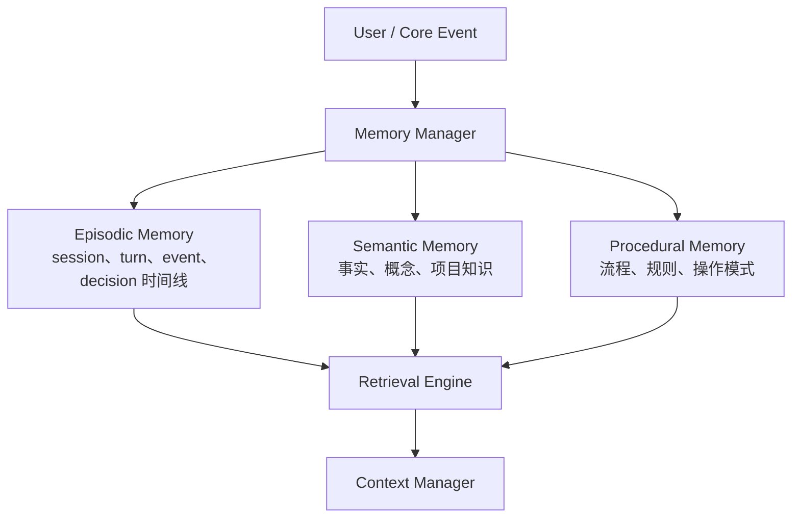
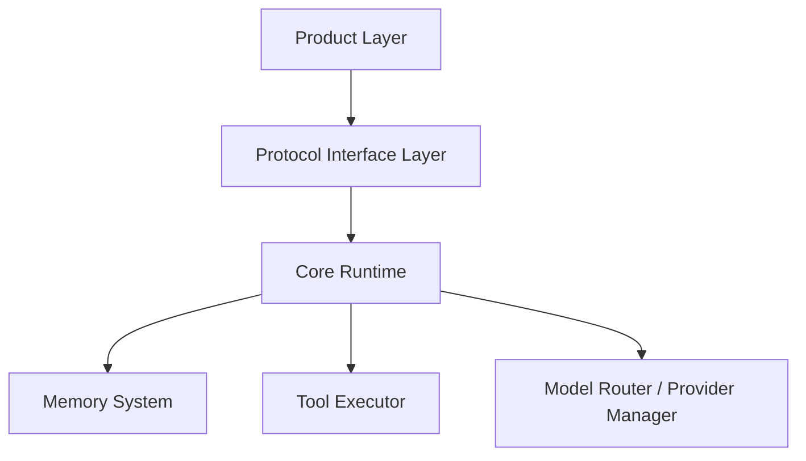

# 04. 项目级配置、记忆与工作区文档

更新时间: 2026-06-04 22:10

## 文档定位

本文定义 Alius 项目级 `.alius/` 的目标目录结构和实现规范。该结构需要服务 v10 架构:

```text
Product Layer -> Protocol Interface Layer -> Core Runtime
```

项目级 `.alius/` 不只是配置目录，还承担三类职责:

- `config/`: 工具、协议、模型、权限、MCP 等项目配置。
- `memory/`: 三层记忆系统、会话、日志和缓存的数据目录。
- `workspace/`: 项目设计文档、规格、历史、产品文档、接口文档、规范和附件。

## 整体目录结构

目标结构:

```text
.alius/
  config/
    config.toml
    soul.toml
    providers.toml
    tools.toml
    permissions.toml
    mcp.json
    protocol.toml
  memory/
    episodic/
      episodic.sqlite
    semantic/
      semantic.sqlite
      vectors/
    procedural/
      procedural.sqlite
    index/
      retrieval.sqlite
    cache/
    logs/
      runtime.log.jsonl
      error.log.jsonl
      audit.log.jsonl
      trace/
    communications/
      sessions/
        <session-id>/
          session.json
          messages.jsonl
  workspace/
    SPEC.md
    ROADMAP.md              # 非权威参考，最新 docs 为准
    HISTORY.md
    .archive/
    docs/
      terms/
        GLOSSARY.md
      products/
        cli.md
        desktop_planning.md
        ide_extension_planning.md
        third_party_agent_app.md
      technology/
        TECHNOLOGY_SELECTION.md
      interfaces/
        product_layer.md
        protocol_interface_layer.md
        core_runtime_api.md
        product_interface_matrix.md
      overview/
        ARCH.md
        DATA_FLOW.md
        DIAGRAMS.md
        ENTITY_RELATIONSHIP.md
        ARCHITECTURE_DETAILS.md
      modules/
        config_manager.md
        protocol_interface_layer.md
        core_runtime.md
        session_manager.md
        agent_engine.md
        logging_manager.md
        shell_gate.md
        memory_manager/
          README.md
          episodic_memory.md
          semantic_memory.md
          procedural_memory.md
        workspace_handler.md
        retrieval_engine.md
    assets/
      modules/
```

兼容读取:

```text
.alius/config.toml              # legacy project config
.alius/mcp.json                 # legacy project MCP config
.alius/soul/.active             # legacy project soul active marker
.alius/memory/project.json      # legacy flat project memory
.alius/memory/design/           # legacy design-doc location
alius/                          # old project directory, read/migrate only
```

设计原则:

- 新实现优先写入 `.alius/config/`、`.alius/memory/`、`.alius/workspace/`。
- 旧路径只用于兼容读取和迁移，不再作为新设计的首选写入位置。
- `.alius/workspace/docs/modules/` 是代码实现的模块级设计源头。
- `.alius/workspace/docs/terms/` 是核心术语源头。
- `.alius/workspace/docs/products/` 是产品形态、使用方式和用户流程源头。
- `.alius/workspace/docs/interfaces/` 是分层接口契约源头。
- `.alius/workspace/docs/overview/DIAGRAMS.md`、`DATA_FLOW.md`、`ENTITY_RELATIONSHIP.md` 是 Mermaid 图表源头。
- `ROADMAP.md` 不是实现依据，最新 workspace docs 才是实现依据。

## 状态根边界

Alius 仍然有项目级和用户级两个状态根:

| 目录 | 定位 | 典型内容 |
| --- | --- | --- |
| `.alius/` | 项目级配置、项目记忆、项目设计、项目会话 | config、memory、workspace |
| `~/.alius/` | 用户级配置、全局缓存、官方 soul、插件、全局 memory | user config、soul、plugins、workflows、global memory |

边界要求:

- 项目行为应优先由 `.alius/config/` 决定。
- 用户级 `~/.alius/` 可以提供默认值和缓存，但不能隐式覆盖项目配置。
- 项目设计文档属于 `.alius/workspace/`，不再放进 `.alius/memory/design/` 作为目标结构。
- 沟通会话属于记忆数据，继续放在 `.alius/memory/communications/`。

## `config/` - 工具配置目录

`config/` 是项目级配置入口，面向 Product Layer、Protocol Interface Layer 和 Core Runtime。

```text
.alius/config/
  config.toml
  soul.toml
  providers.toml
  tools.toml
  permissions.toml
  mcp.json
  protocol.toml
```

### `config.toml`

项目主配置。保存当前项目的基础运行信息:

- 默认 provider。
- 默认 model。
- Agent Card config path。
- workspace root。
- 默认运行模式。
- 是否启用 TUI workspace。

加载优先级:

1. 内嵌默认配置。
2. 用户配置 `~/.alius/config.toml`。
3. 项目配置 `.alius/config/config.toml`。
4. 兼容项目配置 `.alius/config.toml`。
5. 环境变量 `ALIUS__...`。
6. CLI 显式参数。

查找规则:

- 从当前工作目录向上查找项目 `.alius/config/config.toml`。
- 找不到时兼容查找 `.alius/config.toml`。
- 到 `$HOME` 后停止，避免把 `~/.alius` 当作项目目录。

### `soul.toml`

项目 Agent Card 兼容的 TOML 源文件。它是项目级 Agent 身份、能力、skills 和 A2A 暴露信息的来源，用 Agent Card 可映射字段替代原项目 soul 信息。

注意: `soul.toml` 不是发布后的 Agent Card JSON。实现层应读取该 TOML，运行时用于 Prompt / Policy / Skill 选择，发布 A2A 服务时再导出为 `.well-known/agent-card.json`。

目标路径:

```text
.alius/config/soul.toml
```

用途:

- 记录 agent name、description、version。
- 记录 provider 信息。
- 记录 supported interfaces，其中对外服务 `url` 可在发布前留空。
- 记录 documentation/icon 等发布后才确定的公网 URL 字段。
- 记录 capabilities，例如 `streaming`、`push_notifications`、`extended_agent_card`。
- 记录 `default_input_modes` / `default_output_modes`。
- 记录 skills，例如 `frontend_engineering`、`backend_engineering`。
- 预留 security schemes / capability policy 的项目声明。

建议结构:

```toml
[agent]
name = "frontend engineer"
description = "An A2A-compatible Alius agent specialized in frontend engineering."
version = "0.1.0"

[agent_card]
documentation_url = ""
icon_url = ""
export_path = ".well-known/agent-card.json"

[[supported_interfaces]]
url = ""
protocol_binding = "HTTP+JSON"
protocol_version = "1.0"

[provider]
organization = "AliusTech"
url = "https://alius.tech"

[capabilities]
streaming = true
push_notifications = false
extended_agent_card = false

[interaction]
default_input_modes = ["text/plain", "application/json"]
default_output_modes = ["text/plain", "application/json"]

[[skills]]
id = "frontend-engineering"
name = "Frontend Engineering"
description = "Plans, reviews, and implements frontend user interfaces."
tags = ["frontend", "ui", "ux"]
examples = ["Create an implementation plan for a responsive dashboard UI."]
input_modes = ["text/plain", "application/json"]
output_modes = ["text/plain", "application/json"]
```

导出映射:

| `soul.toml` 字段 | A2A Agent Card JSON 字段 |
| --- | --- |
| `[agent].name` | `name` |
| `[agent].description` | `description` |
| `[agent].version` | `version` |
| `[[supported_interfaces]]` | `supportedInterfaces[]` |
| `[agent_card].documentation_url` | `documentationUrl` |
| `[agent_card].icon_url` | `iconUrl` |
| `[provider]` | `provider` |
| `[capabilities].push_notifications` | `capabilities.pushNotifications` |
| `[capabilities].extended_agent_card` | `capabilities.extendedAgentCard` |
| `[interaction].default_input_modes` | `defaultInputModes` |
| `[interaction].default_output_modes` | `defaultOutputModes` |
| `[[skills]]` | `skills[]` |

兼容读取:

```text
.alius/soul/.active
```

迁移策略:

- 读取 legacy active marker。
- 将旧 soul id 映射为 Agent Card 的 name、description、skills 或 runtime metadata。
- 写入 `.alius/config/soul.toml`。
- 不再创建 `.alius/soul/` 项目目录。

### `providers.toml`

模型供应商和模型路由配置。面向 `Model Router` 与 `Provider Manager`。

建议内容:

- provider 列表。
- provider-specific endpoint。
- model aliases。
- light / medium / high 分层模型。
- fallback provider。

### `tools.toml`

工具注册和工具能力配置。面向 `Tool Executor`。

建议内容:

- 内置工具启用/禁用。
- MCP tool 暴露策略。
- plugin tool 暴露策略。
- tool timeout。
- tool confirmation 策略。
- `AcceptEdits` 下 Shell 工具必须经 Shell Gate；`BypassPermissions` 是显式高风险例外。

### `permissions.toml`

项目权限和安全策略。面向 `Security & Policy Manager`。

建议内容:

- filesystem scope。
- shell allowlist / denylist。
- shell command / args / cwd / scope 检查策略。
- workspace 外读写审批策略。
- network allowlist。
- dangerous action confirmation。
- RemoteA2A capability ceiling。

### `mcp.json`

项目 MCP server 声明。

目标路径:

```text
.alius/config/mcp.json
```

兼容路径:

```text
.alius/mcp.json
alius/mcp.json
~/.alius/mcp.json
```

实现要求:

- MCP 配置查找应复用项目根向上查找逻辑。
- MCP tools 进入 Core 时必须映射成 `Tool Executor` 管理的工具能力。
- MCP 调用必须经过 `Security & Policy Manager` 和 `Budget Manager`。

### `protocol.toml`

协议接口层配置。面向 `Protocol Interface Layer`。

建议内容:

- Local Rust Interface 是否启用。
- JSON-RPC socket / stdio 配置。
- A2A 是否启用。
- 能力开关。
- protocol version。
- event stream buffer。
- reconnect / resume 策略。

### logging 配置

日志路径是固定工程约定，不由 `config.toml` 指定。`config.toml` 的 `[logging]` 只管理开启状态、日志级别、脱敏和 flush 策略。

目标路径:

```text
.alius/memory/logs/
```

覆盖:

- runtime log。
- error log。
- exception log。
- audit log。
- trace log。

要求:

- 日志必须关联 workspace、session、run、trace。
- 日志固定写入 `.alius/memory/logs/`。
- error、exception、audit 必须及时 flush。
- API key、token、Authorization header 和敏感输入必须脱敏。

## `memory/` - 三层记忆系统目录

`memory/` 是项目级记忆数据根目录。目标结构采用三层记忆系统:

```text
.alius/memory/
  episodic/
  semantic/
  procedural/
  index/
  cache/
  logs/
  communications/
```



### `episodic/`

情景记忆。保存具体发生过的 session、turn、事件、工具调用和用户决策。它不是无条件保存完整原始聊天记录。

目标文件:

```text
.alius/memory/episodic/episodic.sqlite
```

典型数据:

- session。
- turn。
- message summary / reference。
- tool call。
- user decision。
- CoreEvent trace。

用户输入原文是否保存由 retention/privacy policy 决定，可保存摘要、引用或脱敏内容。

### `semantic/`

语义记忆。保存抽象后的事实、概念、项目知识和 embedding 索引。

目标文件:

```text
.alius/memory/semantic/semantic.sqlite
.alius/memory/semantic/vectors/
```

典型数据:

- 项目事实。
- 模块知识。
- 架构决策摘要。
- 文档 chunk。
- embedding metadata。

### `procedural/`

程序记忆。保存稳定流程、规范、操作步骤和项目约定。

目标文件:

```text
.alius/memory/procedural/procedural.sqlite
```

典型数据:

- 开发流程。
- 测试流程。
- 发布流程。
- 安全审批规则。
- 常用修复路径。

### `index/`

检索索引目录。由 `Retrieval Engine` 使用。

目标文件:

```text
.alius/memory/index/retrieval.sqlite
```

用途:

- keyword index。
- vector metadata。
- score fusion cache。
- memory type routing。

### `communications/`

沟通记录和会话持久化目录。

```text
.alius/memory/communications/sessions/
  <session-id>/
    session.json
    messages.jsonl
```

`session.json` 保存:

- id。
- created_at。
- updated_at。
- workspace。
- model。
- agent_card。
- protocol origin。
- trace id。

`messages.jsonl` 保存会话消息。后续应补充 CoreEvent trace 或引用 trace 文件。

### `logs/`

系统运行日志目录。

```text
.alius/memory/logs/
  runtime.log.jsonl
  error.log.jsonl
  audit.log.jsonl
  trace/
```

用途:

- 记录运行日志。
- 记录异常和错误。
- 记录审批、Shell Gate deny、权限变更等审计事件。
- 按 workspace、session、run、trace 查询。

### legacy `project.json`

旧结构化 project memory:

```text
.alius/memory/project.json
```

迁移策略:

- 读取时兼容。
- 新写入应根据内容类型进入 episodic / semantic / procedural。
- `project.json` 中的普通事实优先迁移到 semantic memory。
- 会话类内容迁移到 episodic memory。
- 流程类内容迁移到 procedural memory。

## `workspace/` - 项目设计文档目录

`workspace/` 是项目级设计文档根目录，用于文档驱动开发。它不等同于 TUI workspace，也不存放模型运行时上下文。

目标结构:

```text
.alius/workspace/
  SPEC.md
  ROADMAP.md              # 非权威参考
  HISTORY.md
  .archive/
  docs/
    terms/
      GLOSSARY.md
    products/
      README.md
      cli.md
      desktop_planning.md
      ide_extension_planning.md
      third_party_agent_app.md
    technology/
      TECHNOLOGY_SELECTION.md
    interfaces/
      README.md
      product_interface_matrix.md
      product_layer.md
      protocol_interface_layer.md
      core_runtime_api.md
    overview/
      ARCH.md
      DATA_FLOW.md
      DIAGRAMS.md
      ENTITY_RELATIONSHIP.md
      ARCHITECTURE_DETAILS.md
    modules/
      config_manager.md
      protocol_interface_layer.md
      core_runtime.md
      session_manager.md
      agent_engine.md
      logging_manager.md
      shell_gate.md
      memory_manager/
        README.md
        episodic_memory.md
        semantic_memory.md
        procedural_memory.md
      workspace_handler.md
      retrieval_engine.md
  assets/
    modules/
```

说明:

- `ROADMAP.md` 只保留非权威参考口径。
- `.archive/` 是已完成版本快照目录，用于与工作版本 diff。
- 架构图、数据流图和实体关系图统一使用 Markdown Mermaid 源文件。

### `docs/terms/`

核心术语目录。

必须包含:

- `GLOSSARY.md`。
- 术语、English ID、定义、边界和备注。
- `Workspace`、`Project`、`Session`、`Turn`、`Run`、`Trace` 的区分。

### `docs/products/`

产品文档目录。

必须覆盖:

- CLI 产品。
- 第三方集成产品。
- Desktop 规划产品。
- IDE 插件规划产品。
- 第三方 Agent 应用。

每个产品文档必须包含定位、市场定位、使用方式、操作流程、用户流程、接口边界和注意事项。

### `docs/technology/`

技术选型目录。按产品记录技术栈、接口、构建目标和状态。

### `docs/interfaces/`

分层接口文档目录。覆盖 Product Layer、Protocol Interface Layer、Core Runtime API 和产品接口矩阵。

### `docs/overview/`

概要设计目录，描述整体架构和核心场景数据流。

#### `ARCH.md`

系统架构概述。

必须包含:

- 三层架构: Product Layer、Protocol Interface Layer、Core Runtime。
- 核心模块划分。
- 模块职责。
- 模块依赖关系。
- 架构图引用。

必须引用 Mermaid 源:

```text
DIAGRAMS.md
ARCHITECTURE_DETAILS.md
```

建议 Mermaid 摘要:



#### `DATA_FLOW.md`

核心场景数据流向。

至少覆盖场景:

1. 记忆存储。
2. 记忆检索。
3. 文档更新。
4. 产品入口到 Core。
5. 工具调用。
6. Shell 门禁。
7. 运行日志。

示例流程:

```text
用户输入
-> CLI / TUI
-> Local Rust Interface
-> Core Public API
-> Agent Engine
-> Memory Manager
-> Episodic Memory
-> 按策略写入事件线、摘要或引用
```

文档更新流程:

```text
用户提出设计变更
-> CLI / TUI
-> Protocol Interface Layer
-> Core Runtime
-> Workspace Handler
-> 更新 .alius/workspace/docs/modules/<module>.md
-> HISTORY.md 追加修改记录
```

### `docs/modules/`

详细设计目录。模块文档必须与代码模块一一对应。开发时以这里的详细设计为实现依据。

每个模块文档必须包含以下章节:

```text
# <模块名>

## 模块职责
## 接口定义
## 内部逻辑
## 数据存储
## 异常处理
## 与其他模块的关系
## 验收标准
```

章节要求:

| 章节 | 内容要求 |
| --- | --- |
| 模块职责 | 明确输入、输出、核心功能，禁止跨职责设计 |
| 接口定义 | 函数名、参数类型和含义、返回值类型和含义、异常条件 |
| 内部逻辑 | 文字流程、伪代码或 Mermaid 流程图 |
| 数据存储 | 依赖的数据文件、表结构、索引、缓存策略 |
| 异常处理 | 错误场景和处理策略 |
| 与其他模块的关系 | 调用方、被调用方、事件流关系 |
| 验收标准 | 可测试的完成条件 |

#### `config_manager.md`

配置管理模块。

覆盖:

- `.alius/config/` 读写。
- 配置加载优先级。
- 旧路径兼容迁移。
- provider / tools / permissions / protocol 配置归并。
- 对 Core Runtime 提供最终项目配置快照。

#### `protocol_interface_layer.md`

协议接口层模块。

覆盖:

- `ProtocolEnvelope`。
- `CoreRequest`。
- `CoreCommand`。
- `CoreEvent`。
- `ProtocolError`。
- Origin 与 Capability 归一化。
- Local Rust、JSON-RPC、IDE RPC、FFI、A2A transport 映射。

该模块详细设计应与 `10-protocol-interface-layer-design.md` 对齐。

#### `core_runtime.md`

核心运行时总览。

覆盖:

- `Core Public API`。
- `Session Manager`。
- `Agent Engine`。
- Prompt、Agent Card、Memory、Tool、Policy、Budget、Store 的调用顺序。
- 统一 event stream。

该模块详细设计应与 `09-architecture-v10-implementation-reference.md` 对齐。

#### `session_manager.md`

Session / Thread / Turn / Task State 管理模块。

覆盖:

- session lifecycle。
- turn lifecycle。
- run id / trace id。
- context snapshot。
- resume / cancel。
- storage mapping。

#### `agent_engine.md`

Agent 主循环模块。

覆盖:

- main loop。
- tool-call loop。
- model stream。
- policy / budget 检查。
- CoreEvent 生成。
- error recovery。

#### `memory_manager/`

记忆系统总控模块。为了保持文件系统可落地，采用目录结构:

```text
docs/modules/memory_manager/
  README.md
  episodic_memory.md
  semantic_memory.md
  procedural_memory.md
```

`README.md` 覆盖:

- Memory Manager 总体职责。
- 三层记忆路由。
- 写入策略。
- 检索策略。
- 和 Retrieval Engine / Context Manager 的关系。

`episodic_memory.md` 覆盖:

- 情景记忆输入输出。
- `memory/episodic/episodic.sqlite` 表结构。
- session / turn / event / message 写入规则。
- retention/privacy policy。

`semantic_memory.md` 覆盖:

- 语义记忆 chunk。
- embedding。
- vector index。
- `memory/semantic/semantic.sqlite` 表结构。

`procedural_memory.md` 覆盖:

- 流程、规则、操作模式的存储。
- procedural memory 的更新条件。
- 与工具执行、工作流和项目规范的关系。

#### `workspace_handler.md`

文档管理模块。

覆盖:

- `.alius/workspace/` 初始化。
- SPEC / HISTORY 管理。
- ROADMAP 非权威参考说明。
- `.archive` 工作版本确认归档。
- docs overview / modules 的读写。
- assets 引用校验。
- 文档修改自动追加 HISTORY。

#### `retrieval_engine.md`

检索引擎模块，负责关键词和向量融合检索。

必须包含接口示例:

```text
函数: hybrid_retrieve(query: str, top_k: int = 5) -> List[Dict]
参数:
  query: 用户检索关键词
  top_k: 返回结果数量
返回值:
  包含 content、score、memory_type 的字典列表
异常:
  query 为空字符串时抛出 ValueError
```

核心流程:

```text
query
-> keyword retrieval
-> vector retrieval
-> score fusion
-> rerank
-> top_k results
```

异常策略:

- query 为空: 返回参数错误。
- vector index 损坏: 自动重建索引。
- semantic memory 不可用: 降级为 keyword retrieval。
- SQLite 锁冲突: 指数退避重试。

### `SPEC.md`

核心功能规格说明书。

要求:

- 作为 `docs/` 设计书的需求源头。
- 每个功能点必须映射到 `docs/modules/` 中的模块。
- 每个功能点应有验收条件。

建议格式:

```text
## F-001 项目配置初始化

需求:
  alius init 创建 .alius/config/、.alius/memory/、.alius/workspace/

对应模块:
  docs/modules/config_manager.md
  docs/modules/workspace_handler.md

验收:
  新项目初始化后目录结构完整，旧路径不作为首选写入位置。
```

### `ROADMAP.md`

非权威 Roadmap 说明。

要求:

- 不作为实现依据。
- 明确最新实现依据是 `SPEC.md` 和 `docs/`。
- 阶段计划变化可放在 issue、PR 或单独计划文档中。
- 不要求每次设计变更同步 Roadmap。

### `HISTORY.md`

文档修改历史。

格式:

```text
[时间] [修改人]: [文档路径] - [修改摘要]
```

示例:

```text
2026-06-04 15:00 user: docs/modules/retrieval_engine.md - 新增混合检索分数融合逻辑
```

实现要求:

- 所有 `.alius/workspace/` 下文档修改都应追加 HISTORY。
- 自动写入时使用本地时间。
- 修改摘要应短句描述，不写大段正文。

### `assets/`

文档附件目录。

```text
.alius/workspace/assets/
  modules/
    memory_manager_flow.png
    retrieval_engine_flow.png
```

命名要求:

- 架构图主来源: `docs/overview/DIAGRAMS.md` 中的 Mermaid 图。
- 数据流图主来源: `docs/overview/DATA_FLOW.md` 中的 Mermaid 图。
- 实体关系图主来源: `docs/overview/ENTITY_RELATIONSHIP.md` 中的 Mermaid ER 图。
- `assets/` 只保存 Mermaid 导出的 PNG / SVG 或其他附件。

## 文档驱动开发约束

1. `SPEC.md` 是需求源头。
2. `docs/terms/` 是术语源头。
3. `docs/products/` 是产品设计源头。
4. `docs/interfaces/` 是接口契约源头。
5. `docs/overview/` 是概要设计。
6. `docs/modules/` 是详细设计。
7. 代码实现必须能追溯到对应模块文档。
8. 工程交付时需要验证代码接口和模块文档的接口定义一致。
9. 文档修改必须写入 `HISTORY.md`。
10. 架构图、流程图、模块图和实体关系图必须以 Markdown Mermaid 为主来源；`assets/` 只保存导出产物和附件。
11. `ROADMAP.md` 不作为实现依据。

## 初始化与迁移策略

`alius init` 的目标行为:

```text
1. 创建 .alius/config/
2. 创建 .alius/memory/
3. 创建 .alius/workspace/
4. 写入 config/config.toml
5. 写入 config/mcp.json
6. 初始化 workspace/SPEC.md、ROADMAP.md、HISTORY.md
7. 初始化 workspace/docs/terms/
8. 初始化 workspace/docs/products/
9. 初始化 workspace/docs/interfaces/
10. 初始化 workspace/docs/technology/
11. 初始化 workspace/docs/overview/ 和 workspace/docs/modules/
12. 初始化 workspace/.archive/
```

旧项目迁移:

| 旧路径 | 新路径 | 策略 |
| --- | --- | --- |
| `.alius/config.toml` | `.alius/config/config.toml` | 读取兼容，迁移时复制后保留旧文件 |
| `.alius/mcp.json` | `.alius/config/mcp.json` | 读取兼容，迁移时复制后保留旧文件 |
| `.alius/soul/.active` | `.alius/config/soul.toml` | 读取兼容，迁移为项目配置文件，不再创建 soul 目录 |
| `.alius/memory/project.json` | `.alius/memory/semantic/semantic.sqlite` 等 | 按内容分类迁移 |
| `.alius/memory/design/` | `.alius/workspace/docs/` | 文档迁移到 workspace，保留 legacy 只读 |
| `alius/` | `.alius/` | 只读兼容，提示迁移 |

## 实现优先级

第一期只要求完成目录和主路径所需的最小集合:

```text
.alius/config/config.toml
.alius/config/soul.toml
.alius/config/mcp.json
.alius/config/protocol.toml
.alius/config/permissions.toml
.alius/memory/communications/
.alius/memory/episodic/
.alius/memory/logs/
.alius/workspace/SPEC.md
.alius/workspace/ROADMAP.md
.alius/workspace/HISTORY.md
.alius/workspace/docs/terms/GLOSSARY.md
.alius/workspace/docs/products/cli.md
.alius/workspace/docs/technology/TECHNOLOGY_SELECTION.md
.alius/workspace/docs/interfaces/product_interface_matrix.md
.alius/workspace/docs/overview/ARCH.md
.alius/workspace/docs/overview/DATA_FLOW.md
.alius/workspace/docs/overview/DIAGRAMS.md
.alius/workspace/docs/modules/config_manager.md
.alius/workspace/docs/modules/protocol_interface_layer.md
.alius/workspace/docs/modules/core_runtime.md
.alius/workspace/docs/modules/session_manager.md
.alius/workspace/docs/modules/shell_gate.md
.alius/workspace/docs/modules/logging_manager.md
```

暂缓:

- 完整 semantic vector index。
- 完整 procedural memory。
- 全量模块资产图自动生成。
- 自动文档一致性检查。

## 设计原则总结

1. 模块化设计: 设计书按 overview 和 modules 拆分，与代码模块一一映射。
2. 轻量可维护: 单文档聚焦单一模块或主题，降低阅读和系统解析成本。
3. 文档驱动开发: `docs/modules/` 是代码实现的模块级标准。
4. 架构对齐: documents 文档必须反映 Product、Protocol Interface、Core Runtime 三层架构。
5. 路径清晰: config、memory、documents 分离，避免配置、记忆和设计文档互相混用。
6. 兼容迁移: 旧路径可以读，但新实现应写入目标路径。
