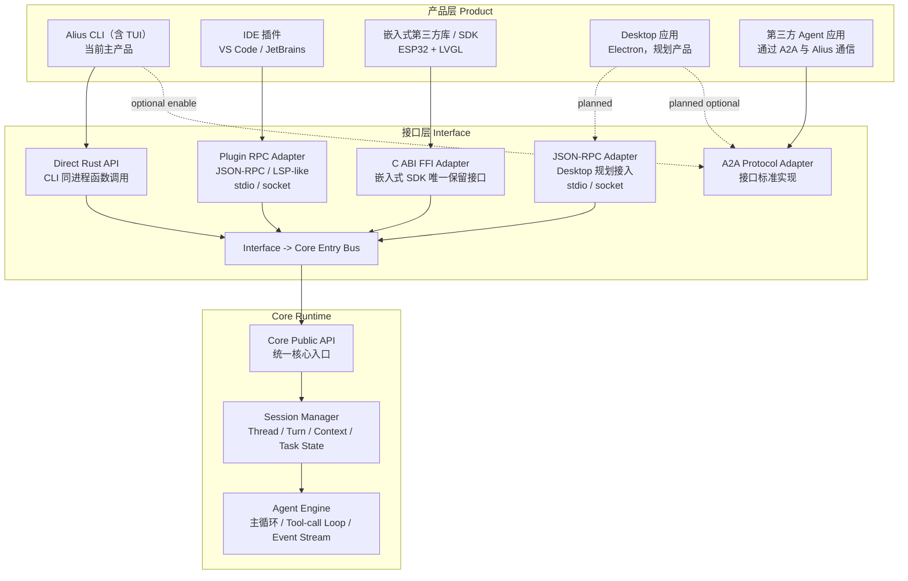
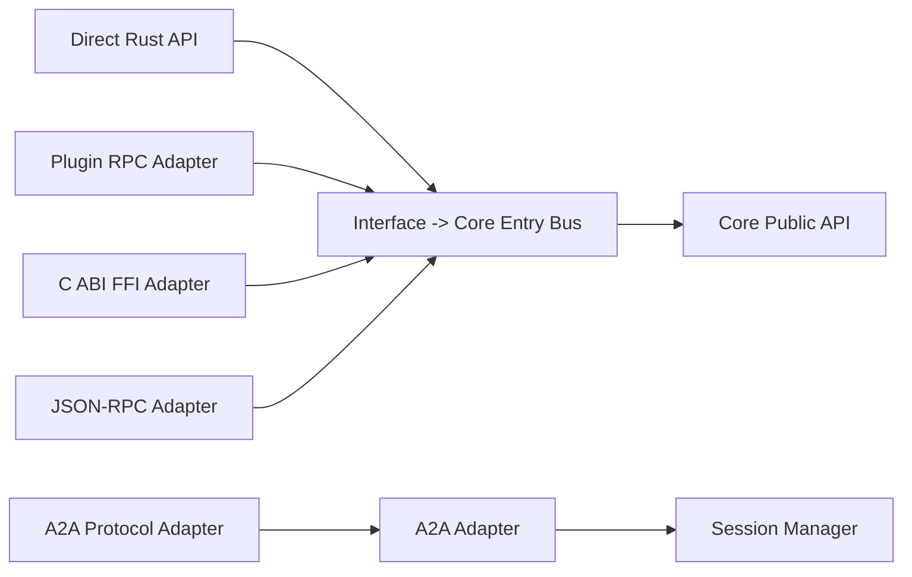
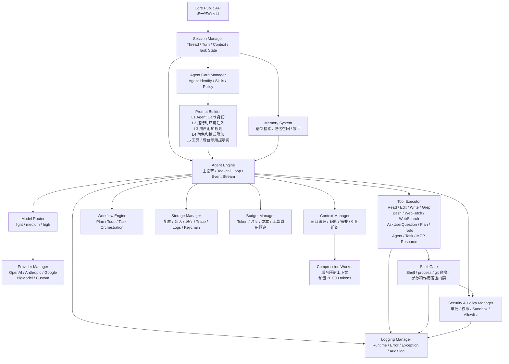
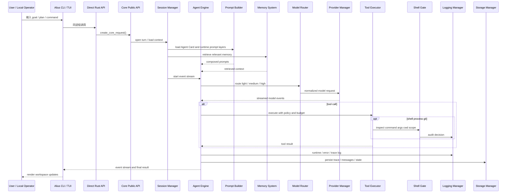
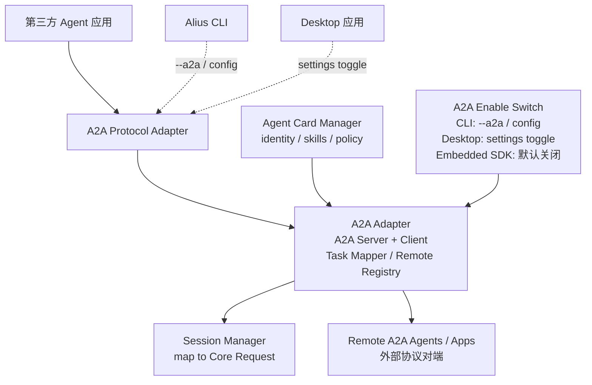
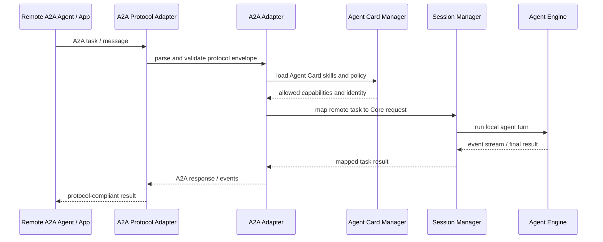
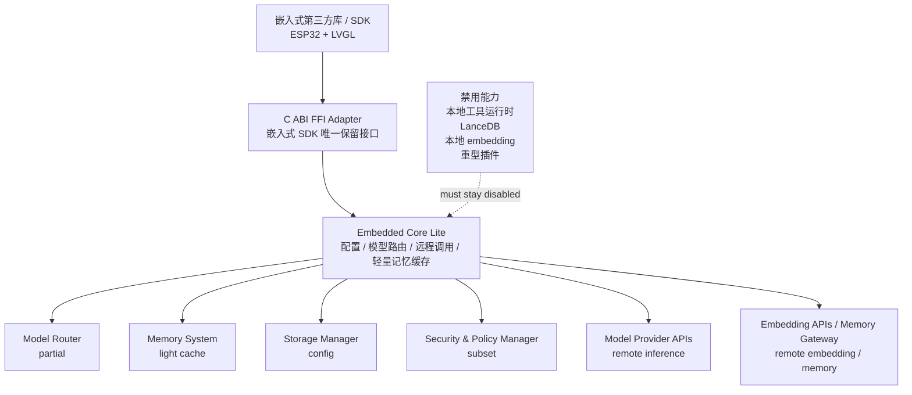
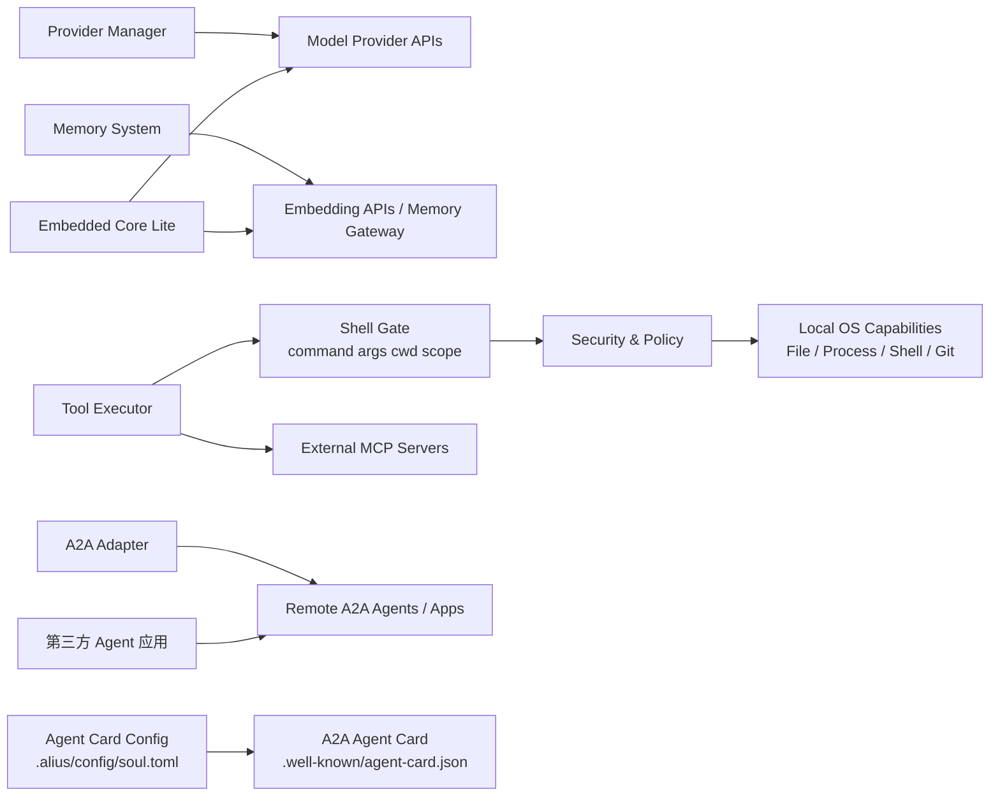
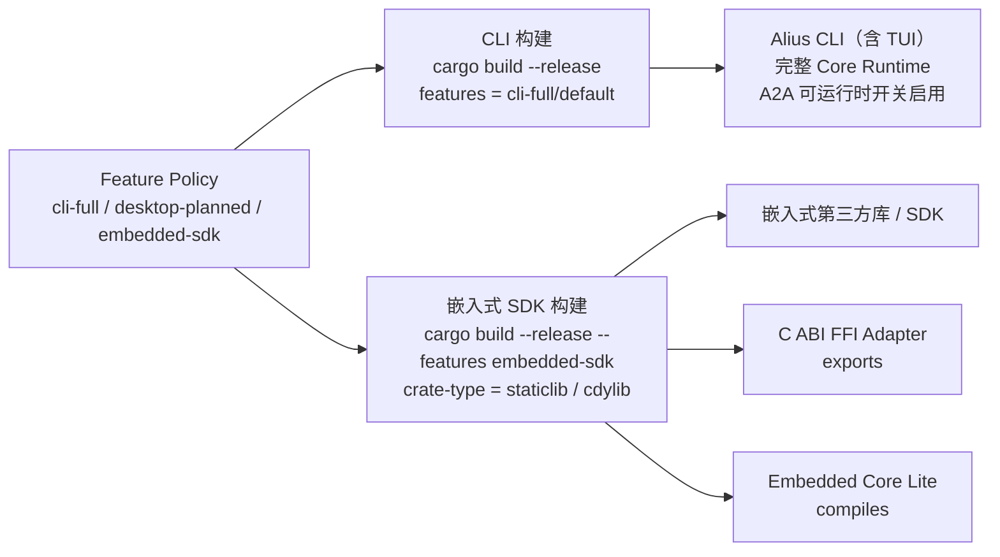
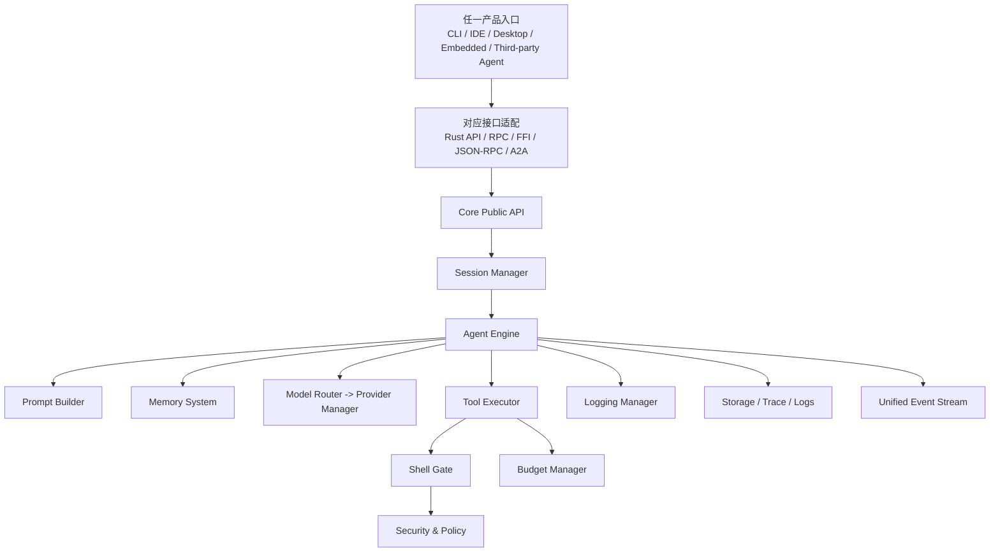

# 09. Alius Architecture v10 实现对照文档

更新时间: 2026-06-04 22:10

来源:

- `.alius/workspace/docs/overview/DIAGRAMS.md`
- `.alius/workspace/docs/overview/ARCHITECTURE_DETAILS.md`
- 图表维护格式: Markdown Mermaid

## 文档目标

本文档把 v10 Mermaid 架构图整理成实现阶段可对照的 Markdown 说明和 Mermaid 图表。核心用途:

- 明确 Alius 的三层主架构边界。
- 明确各产品形态通过哪类接口进入 Core Runtime。
- 明确 Core Runtime 内部模块职责和主要依赖关系。
- 明确 A2A、Embedded Core Lite、Cargo Features 的实现约束。
- 为后续拆 crate、写 trait、接默认执行路径、写测试提供检查清单。

## 总览

Alius v10 不是单一 CLI 架构，而是:

```text
多产品入口 -> 多协议接口适配 -> 统一 Core Runtime
```

右侧的外部资源不是架构层，只是 Core Runtime 的外部依赖。底部的 Cargo Features 也不是运行时层，而是把同一套架构裁剪成 CLI、Desktop、Embedded SDK 等不同编译目标。



## 三层架构

### 1. 产品层 Product

产品层只定义宿主形态和用户入口，不承载 Agent Runtime 的核心逻辑。

| 产品 | 定位 | 入口方式 | 当前状态 |
| --- | --- | --- | --- |
| Alius CLI（含 TUI） | 当前主产品 | Direct Rust API；可选 A2A | 主产品 |
| IDE 插件 | VS Code / JetBrains 扩展 | Plugin RPC Adapter | 规划或扩展接入 |
| 嵌入式第三方库 / SDK | ESP32 + LVGL 等嵌入式宿主 | C ABI FFI Adapter | 需要 Core Lite 裁剪 |
| Desktop 应用 | Electron 桌面产品 | JSON-RPC Adapter；可选 A2A | 规划产品 |
| 第三方 Agent 应用 | 外部 Agent 对端 | A2A Protocol Adapter | 通过 A2A 通信 |

设计约束:

- 产品层不能绕过接口层直接调用内部模块。
- CLI 是当前主产品，但 Core Runtime 不应被设计成 CLI 私有。
- 第三方 Agent 应用不是 plugin，也不是本地 tool，而是 A2A 协议对端。

### 2. 接口层 Interface

接口层负责把不同产品入口适配为 Core Runtime 能处理的统一请求。

| 接口 | 服务对象 | 传输/ABI | 目标 |
| --- | --- | --- | --- |
| Direct Rust API | CLI / TUI | 同进程 Rust 函数调用 | 最短路径进入 Core Public API |
| Plugin RPC Adapter | IDE 插件 | JSON-RPC / LSP-like，stdio / socket | 支持 IDE 扩展进程与 Core 通信 |
| C ABI FFI Adapter | Embedded SDK | C ABI，staticlib / cdylib | 嵌入式 SDK 唯一保留接口 |
| JSON-RPC Adapter | Desktop | JSON-RPC，stdio / socket | Desktop 规划接入 |
| A2A Protocol Adapter | 第三方 Agent / 可选 CLI / 可选 Desktop | A2A 标准协议 | 远端 Agent task 通信 |

接口层的统一入口是 `Interface -> Core Entry Bus`。除 A2A 的特殊协议映射外，接口层最终应进入 `Core Public API`。



实现约束:

- `Core Public API` 应定义稳定的请求、响应、事件流和错误模型。
- JSON-RPC、Plugin RPC、A2A、FFI 都应只做协议适配，不复制 Agent Engine 逻辑。
- FFI 应优先对接 Core Lite，不默认暴露完整本地工具运行时。

### 3. Core Runtime

Core Runtime 是统一执行层。主干链路:

```text
Core Public API -> Session Manager -> Agent Engine
```



## Core 模块职责

| 模块 | 主要职责 | 输入 | 输出 | 实现检查点 |
| --- | --- | --- | --- | --- |
| Core Public API | 统一核心入口 | 产品请求、协议适配请求 | Core request id、event stream、final result | API 不暴露 UI 私有结构 |
| Session Manager | Thread / Turn / Context / Task State | Core request、session id、workspace context | session state、turn state、context snapshot | session 状态可持久化和恢复 |
| Agent Engine | 主循环、tool-call loop、event stream | prompt、memory、tools、model policy | events、tool calls、assistant result | 默认路径必须经过 engine，而不是绕到 provider |
| Prompt Builder | 多层 prompt 组装 | Agent Card、runtime env、用户规则、工具提示词 | system/developer/tool prompts | L1-L5 层次可测试、可覆盖 |
| Agent Card Manager | Agent identity、skills、capabilities、policy | `.alius/config/soul.toml` | prompt source、policy、A2A Agent Card | Agent Card 驱动 Prompt 与 A2A 策略 |
| Memory System | 语义检索、召回、写回 | query、session context、project memory | retrieved context、memory writes | 标准 memory 和轻量 memory 可分层 |
| Model Router | 三层模型分流 | task type、budget、policy | light / medium / high model choice | 分流规则独立于 provider |
| Provider Manager | provider 接入 | model request | normalized stream / response | provider 差异在此收敛 |
| Tool Executor | 工具注册和执行 | tool call、permissions、context | tool result / error | 统一纳入 security、budget、trace |
| Shell Gate | shell/process/git 命令门禁 | command、args、cwd、workspace、policy | allow / deny / approval required | 检查命令、参数和作用范围，workspace 外读写需授权 |
| Workflow Engine | Plan / Todo / Task 编排 | workflow state、engine events | step events、orchestration updates | 复用 tool/model/session，不自建执行器 |
| Storage Manager | 配置、会话、缓存、trace、logs、keychain | state changes、secrets、trace events、log records | persisted state | 明确项目级和用户级边界 |
| Security & Policy Manager | 审批、权限、sandbox、allowlist | tool request、policy、product capability | allow / deny / ask | 所有危险工具必须经过这里 |
| Logging Manager | 实时运行日志、错误、异常、审计 | module log records、errors、policy decisions | runtime/error/audit/trace logs | 日志按 workspace、session、run、trace 关联 |
| Budget Manager | token、失败、时间、成本、工具调用预算 | engine events、usage metrics | continue / stop / circuit break | token 超限终止，连续失败 >= 3 熔断 |
| Context Manager | 上下文窗口、截断、摘要、引用组织 | session state、retrieved memory、new events | model-ready context | 与 Compression Worker 明确触发边界 |
| Compression Worker | 后台压缩上下文 | context snapshot | compressed summary | 预留 20,000 tokens 压缩空间 |
| A2A Adapter | A2A server/client、task mapper、remote registry | A2A protocol messages、Agent Card policy | Core request、A2A response/event | 由产品开关启用，由 Agent Card 策略驱动 |
| Embedded Core Lite | 嵌入式裁剪 Core | FFI request | remote model/memory call、lite result | 禁用 heavy tools、LanceDB、本地 embedding |

## 主请求链路

CLI / TUI 的目标实现路径应收敛到 Core Runtime:



实现检查点:

- CLI / TUI 只负责输入、渲染和产品状态，不直接拼完整 agent loop。
- session、memory、prompt、tool、Shell Gate、budget、security、logging 都应出现在同一个 engine event stream 或 trace/log 关联中。
- 所有协议入口最终都应该产生统一的 Core request。

## A2A 设计

A2A 是 v10 架构中连接第三方 Agent 应用的标准协议入口。它不是本地插件，也不是普通 tool。





A2A 实现约束:

- A2A 是否启用由产品开关决定，不是 Core 永远监听。
- A2A 能暴露什么能力由 Agent Card skills、capabilities 和 policy 决定。
- A2A task 必须映射为 Core request，不能单独实现一套 runtime。
- 第三方 Agent 应用和 Alius 之间是外部协议关系，不应访问本地内部数据结构。

## Embedded Core Lite

Embedded SDK 通过 C ABI FFI Adapter 进入 Core Lite。Core Lite 是裁剪后的 Core，不是完整 Core Runtime 的简单导出。



Core Lite 实现约束:

- 只保留部分 Core 功能: 配置、模型路由、远程调用、轻量记忆缓存。
- 默认禁用本地工具运行时、LanceDB、本地 embedding、重型插件。
- A2A 默认不编译或关闭。
- FFI API 应稳定、窄接口、显式生命周期管理，避免把 Rust 内部复杂对象泄漏给 C ABI。

## 外部资源

外部资源是 Core Runtime 的依赖，不是 Alius 自身架构层。

| 外部资源 | 调用方 | 用途 |
| --- | --- | --- |
| Model Provider APIs | Provider Manager / Embedded Core Lite | 远程模型推理 |
| Embedding APIs / Memory Gateway | Memory System / Embedded Core Lite | embedding、远程 memory 网关 |
| Local OS Capabilities | Tool Executor / Shell Gate / Security Policy | 文件、进程、Shell、Git |
| External MCP Servers | Tool Executor | MCP tools 和 resources |
| Remote A2A Agents / Apps | A2A Adapter / 第三方 Agent 应用 | 外部 A2A 协议对端 |
| Legacy Soul Repository | Legacy installed soul data | 可作为迁移到 Agent Card 的输入 |



## Cargo Features 与构建目标



| 构建目标 | 命令 / feature | 编译内容 | A2A 策略 | 禁用内容 |
| --- | --- | --- | --- | --- |
| CLI | `cargo build --release`，`features = cli-full/default` | 完整 Core Runtime | 可运行时开关启用 | 无架构图强制禁用项 |
| Desktop planned | `desktop-planned` | JSON-RPC + optional A2A | settings toggle | 未在 v10 图中展开 |
| Embedded SDK | `cargo build --release --features embedded-sdk` | FFI + Core Lite，`staticlib / cdylib` | 默认不编译或关闭 | heavy tools、LanceDB、local embedding、plugin runtime |

Feature policy:

- `cli-full`: tools + memory-standard + optional a2a + local embedding。
- `desktop-planned`: json-rpc + optional a2a。
- `embedded-sdk`: ffi + core-lite + remote model/embedding。

实现检查点:

- feature 不只是编译开关，也应影响模块注册、接口暴露、默认能力和测试矩阵。
- `embedded-sdk` 下不应通过依赖链意外拉入 heavy tools、LanceDB、本地 embedding 或 plugin runtime。
- `cli-full` 下 A2A 是 optional，需要运行时开关控制监听或暴露。

## 建议的实现分解

### 第一阶段: Core Public API 和默认路径收敛

目标: 先把 CLI / TUI 的默认执行路径收敛到统一 Core request 和 Agent Engine。

检查清单:

- 定义 `CoreRequest`、`CoreEvent`、`CoreResult`、`CoreError`。
- `Core Public API` 支持同步 final result 和 streaming event 两种消费方式。
- `Session Manager` 统一管理 thread、turn、context、task state。
- `Agent Engine` 统一调用 Prompt Builder、Memory System、Model Router、Tool Executor。
- CLI / TUI 不再绕过 Agent Engine 直接走 provider chat stream。

### 第二阶段: Policy、Budget、Security、Shell Gate 纳入 tool-call loop

目标: 所有工具调用都可审计、可拒绝、可预算中止。

检查清单:

- `Tool Executor` 调用前必须经过 `Security & Policy Manager`。
- shell/process/git 调用必须经过 `Shell Gate`，检查命令、参数、cwd、路径、glob、symlink 和重定向。
- workspace 外读写必须授权。
- `rm -rf` 类 destructive 命令默认拒绝或强制审批。
- `Budget Manager` 订阅 engine events，能中止 token 超限、时间超限、成本超限、工具调用超限。
- 连续失败大于等于 3 次时触发熔断。
- 每次工具调用写入 trace 和日志，并能和 session / turn / run 关联。

### 第二阶段补充: Logging Manager

目标: 系统运行日志、异常、错误和审计日志实时记录。

检查清单:

- runtime、error、exception、audit 日志写入 `.alius/memory/logs/`。
- 日志关联 workspace、session、run、trace。
- approval、deny、Shell Gate 拒绝和 policy conflict 进入 audit log。
- API key、token、Authorization header 和敏感输入脱敏。
- CLI/TUI 退出前 flush。

### 第三阶段: Memory、Context、Compression 标准化

目标: 把 memory 召回、上下文窗口、后台压缩做成可预测管线。

检查清单:

- `Memory System` 负责检索和写回，`Context Manager` 负责组织上下文窗口。
- `Compression Worker` 只做后台压缩，不直接改变正在执行的 turn。
- 保留 `20,000 tokens` 压缩空间的策略应可配置或至少集中定义。
- memory-standard 和 light memory cache 应通过 trait 或 feature 边界隔离。

### 第四阶段: A2A 接入

目标: 第三方 Agent 应用通过 A2A 与 Alius 通信，并映射为 Core request。

检查清单:

- 实现 `A2A Protocol Adapter` 和 `A2A Adapter` 的边界。
- `A2A Enable Switch` 支持 CLI `--a2a / config`。
- `.alius/config/soul.toml` 提供 identity、skills 和 policy。
- A2A task 映射到 `Session Manager`，由 `Agent Engine` 执行。
- Remote Registry 不泄漏本地 session 内部结构。

### 第五阶段: Embedded SDK 与 Core Lite

目标: 通过 FFI 输出可嵌入的轻量 SDK，不拉入完整 Core。

检查清单:

- `embedded-sdk` feature 只编译 FFI + Core Lite。
- `crate-type = staticlib / cdylib` 可稳定产出。
- Core Lite 禁用本地工具运行时、LanceDB、本地 embedding、重型插件。
- Core Lite 只接远程 model / embedding / memory gateway。
- C ABI 有明确 init、request、poll/free、shutdown 生命周期。

## 模块边界原则

1. 产品层只做产品体验，不做 runtime。
2. 接口层只做协议适配，不做 Agent Engine。
3. Core Public API 是所有本地和远端入口的统一边界。
4. Session Manager 是 thread、turn、context、task state 的唯一所有者。
5. Agent Engine 是主循环和 event stream 的唯一所有者。
6. Prompt、Agent Card、Memory、Context 各自独立，但必须在 Engine 中形成确定顺序。
7. Tool、Security、Budget、Trace 必须在同一条 tool-call loop 上工作。
8. shell/process/git 必须经过 Shell Gate，不能由 Tool Executor 直接越权访问 Local OS。
9. Logging Manager 必须实时记录运行日志、错误、异常和审计。
10. A2A 是远端 Agent 协议，不是本地 plugin，也不是普通 MCP tool。
11. Embedded Core Lite 是裁剪目标，不允许通过 feature 泄漏完整 runtime。
12. 外部资源只能通过对应 manager 访问，不能从产品层或接口层直接访问。

## 与当前实现对齐时的重点问题

这些问题后续实现时应优先核对:

| 问题 | v10 期望 | 实现对照点 |
| --- | --- | --- |
| 默认 TUI 执行路径 | 进入 Core Public API -> Session Manager -> Agent Engine | 检查是否仍直接调用 provider stream |
| Tool loop | Agent Engine 统一调度 | 检查 tools、MCP、plugin、workflow 是否进入统一 Tool Executor |
| 权限和预算 | tool-call loop 内强制执行 | 检查危险工具是否可绕过审批或预算 |
| Shell 门禁 | shell/process/git 命令、参数和作用范围受控 | 检查 `rm -rf`、workspace 外读写、symlink、glob、重定向是否被拦截 |
| Logging | runtime/error/exception/audit 实时记录 | 检查日志是否可按 workspace/session/run/trace 查询 |
| A2A | 由开关启用，由 Agent Card skills 和 policy 驱动 | 检查 A2A 是否只是 UI scaffold 或协议未接 session |
| Core Lite | feature 裁剪后的轻量 runtime | 检查 embedded build 依赖树是否拉入 heavy modules |
| Prompt Builder | L1-L5 分层 | 检查 prompt 拼接是否散落在 UI 或 provider 层 |
| Memory / Context | Memory 负责召回，Context 负责组织窗口 | 检查二者是否混在 session 或 UI 里 |

## 验收图

实现完成后，最小可验收架构应满足:



最小验收标准:

- 至少 CLI 主路径可以通过 Core Public API 运行一次完整 turn。
- event stream 中能观察到 session、prompt、model、tool、budget、trace 的关键事件。
- A2A 入口可以把外部 task 映射成 Core request，哪怕初期只支持受限能力。
- Embedded feature 构建时能证明 heavy modules 没有被编译进来。
