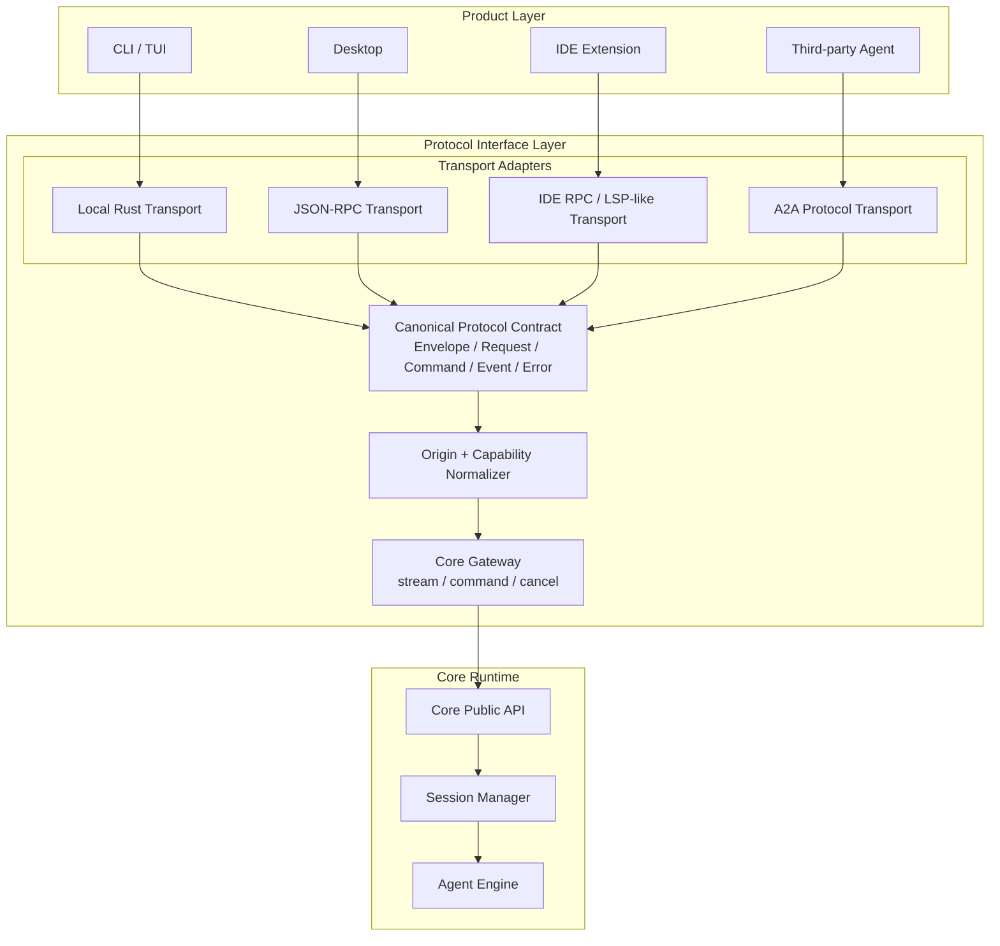
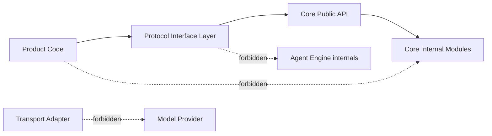
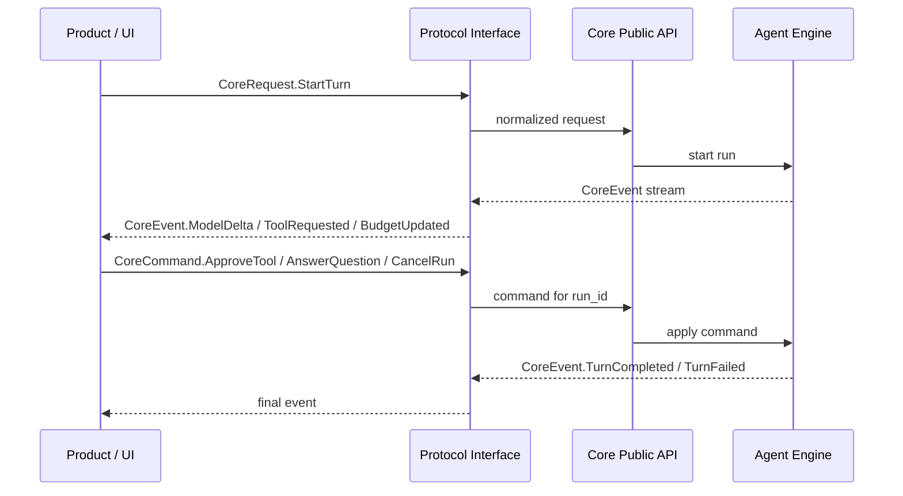
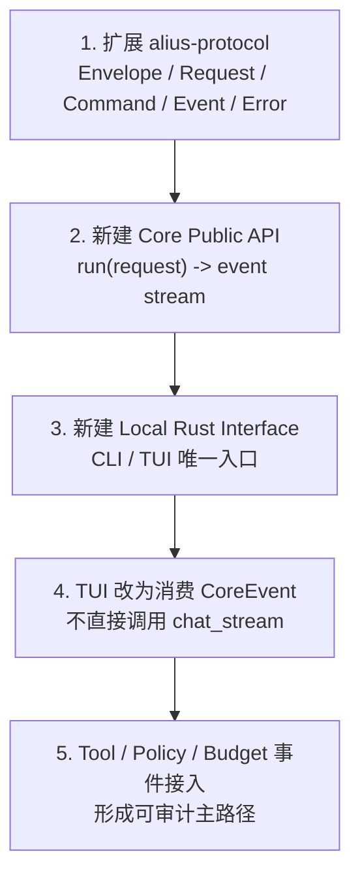

# 10. 协议层优化设计

更新时间: 2026-06-04 22:10

## 设计目标

协议层是产品层和 Core Runtime 之间的唯一工程边界。它的目标不是简单转发函数调用，而是把所有产品入口统一成同一套可版本化、可审计、可流式、可中断的通信契约。

核心原则:

- CLI / TUI / Desktop / IDE / Third-party Agent 都不能直接调用 Core 内部模块。
- 不同通信方式可以不同，但语义必须统一。
- Core Runtime 不关心调用方使用 Rust、JSON-RPC 还是 A2A。
- 工具审批、用户提问、取消、恢复、预算中断都必须通过协议层表达。

目标形态:

```text
Product Layer
  -> Protocol Interface Layer
  -> Core Runtime
```

## 协议层定位

Mermaid 架构图里的 Interface 层建议升级为 `Protocol Interface Layer`，内部拆成三部分:



三部分职责:

| 子模块 | 职责 | 不应该做的事 |
| --- | --- | --- |
| Transport Adapters | 处理本地函数、JSON-RPC、LSP-like、A2A 的传输细节 | 不做 agent loop，不拼 prompt，不直接调用 provider |
| Canonical Protocol Contract | 定义统一 envelope、request、command、event、error、capability | 不绑定具体产品 UI 或某个远程协议 |
| Core Gateway | 把协议消息转成 Core Public API 调用，管理 stream、command、cancel | 不拥有 session 业务状态，不实现工具逻辑 |

## 与 Core 的边界

协议层只和 `Core Public API` 通信。Core 内部的 `Session Manager`、`Agent Engine`、`Tool Executor`、`Memory System` 等模块不应该被产品层或传输层直接依赖。



依赖方向建议:

```text
alius-cli / alius-interactive
  depends on alius-interface-local

alius-interface-local
  depends on alius-protocol
  depends on alius-core

alius-interface-jsonrpc
  depends on alius-protocol
  depends on alius-core

alius-core
  depends on alius-protocol
```

注意: `alius-protocol` 应该只放共享契约和序列化类型，不能反向依赖 Core。

## 通信模型

Alius 的执行不是简单 request/response，而是长生命周期的双向会话:

- 产品层发起一次 turn。
- Core 通过 event stream 输出进度和结果。
- 执行过程中 Core 可能请求用户审批、选择或输入。
- 产品层可以取消、恢复或回应 Core 的请求。

因此协议层应定义三类消息:

```text
CoreRequest: 创建 session、启动 turn、恢复 task。
CoreCommand: 对正在运行的 run 发送控制指令。
CoreEvent: Core 向产品层发出的状态、内容、审批、错误和结果。
```



## 统一 Envelope

所有协议消息都应该包在统一 envelope 里。传输层可以序列化成 Rust struct、JSON-RPC params、A2A payload 或 FFI buffer，但语义字段保持一致。

```rust
pub struct ProtocolEnvelope<T> {
    pub protocol_version: ProtocolVersion,
    pub message_id: MessageId,
    pub trace_id: TraceId,
    pub parent_message_id: Option<MessageId>,
    pub origin: Origin,
    pub capability_scope: CapabilityScope,
    pub session_ref: Option<SessionRef>,
    pub run_ref: Option<RunRef>,
    pub payload: T,
}
```

关键字段:

| 字段 | 说明 |
| --- | --- |
| `protocol_version` | 协议版本，用于兼容和能力协商 |
| `message_id` | 当前消息唯一 id |
| `trace_id` | 跨 transport / Core / tool / storage 的追踪 id |
| `parent_message_id` | 对应请求或事件的父消息 |
| `origin` | 调用来源，例如 LocalCli、Desktop、Ide、RemoteA2A |
| `capability_scope` | 调用方被授予的能力边界 |
| `session_ref` | session 引用，不暴露内部 session 状态 |
| `run_ref` | 当前运行引用，用于 command、cancel、resume |
| `payload` | request、command、event 或 error |

## Origin 与 Capability

协议层必须在进入 Core 前归一化调用来源和能力范围。不同产品即使发起相同动作，也不应该拥有相同权限。

```rust
pub enum OriginKind {
    LocalCli,
    LocalTui,
    Desktop,
    IdeExtension,
    RemoteA2A,
}

pub struct Origin {
    pub kind: OriginKind,
    pub product: String,
    pub transport: TransportKind,
    pub user_id: Option<String>,
    pub workspace_root: Option<PathBuf>,
    pub remote_agent_id: Option<String>,
}
```

能力建议拆成显式 capability:

```rust
pub struct CapabilityScope {
    pub filesystem: FileSystemScope,
    pub shell: ShellScope,
    pub network: NetworkScope,
    pub tools: ToolScope,
    pub memory: MemoryScope,
    pub a2a: A2AScope,
    pub max_budget: BudgetLimit,
}
```

默认能力策略:

| Origin | 默认能力 |
| --- | --- |
| LocalCli / LocalTui | 可访问当前 workspace，危险操作需要审批 |
| Desktop | 可访问用户授权 workspace，危险操作需要审批 |
| IdeExtension | 默认限制在 IDE workspace，文件写入需遵守 IDE 权限 |
| RemoteA2A | 默认无本地文件和 shell 权限，只能使用 Agent Card 暴露的 skills 和 capability policy |

## CoreRequest

`CoreRequest` 负责启动新的工作或打开已有上下文。

```rust
pub enum CoreRequest {
    OpenSession(OpenSessionRequest),
    StartTurn(StartTurnRequest),
    ResumeRun(ResumeRunRequest),
    InspectSession(InspectSessionRequest),
}
```

建议最小字段:

```rust
pub struct StartTurnRequest {
    pub session_ref: Option<SessionRef>,
    pub input: UserInput,
    pub mode: RunMode,
    pub attachments: Vec<InputAttachment>,
    pub requested_capabilities: CapabilityScope,
    pub model_preference: Option<ModelPreference>,
    pub agent_card_ref: Option<AgentCardRef>,
    pub idempotency_key: Option<String>,
}
```

设计约束:

- `StartTurnRequest` 不直接携带 provider-specific 参数。
- `requested_capabilities` 是请求能力，不是最终授权能力。
- 最终能力由协议层 normalizer、Agent Card capability policy、Security Manager 共同收敛。
- `idempotency_key` 用于 JSON-RPC、A2A、Desktop 重试时避免重复执行。

当前 Core Runtime 入口使用三种 `RuntimeMode`:

| RuntimeMode | 默认 LoopPolicy | 权限策略 |
| --- | --- | --- |
| `Chat` | `LoopPolicy::chat()` | `AcceptEdits` |
| `Bypass` | `LoopPolicy::bypass()` | `BypassPermissions` |
| `Plan` | `LoopPolicy::plan()` | `BypassPermissions` |

`LoopPolicy` 必须显式携带 `permission_strategy`:

- `AcceptEdits`: 高风险工具调用触发 `ToolConfirmationRequired`，由用户批准或拒绝。
- `BypassPermissions`: 跳过 Alius 自身确认、workspace 边界、Shell Gate、插件 host permission 等拦截，连续执行当前策略下的工具调用。

Plan 提案被用户批准后默认使用 `LoopPolicy::plan()`，即 `BypassPermissions`。TUI 执行期按 `Shift+Tab` 切换到 `LoopPolicy::plan_accept_edits()`，后续确认点必须等待用户确认。`BypassPermissions` 不能绕过操作系统权限、文件不存在、命令失败、进程启动失败、网络失败或工具实现错误。

## CoreCommand

`CoreCommand` 作用于已存在的 `run_ref`。这解决执行中审批、回答、取消、暂停的问题。

```rust
pub enum CoreCommand {
    ApproveTool(ApproveToolCommand),
    RejectTool(RejectToolCommand),
    AnswerQuestion(AnswerQuestionCommand),
    SelectOption(SelectOptionCommand),
    UpdatePlan(UpdatePlanCommand),
    CancelRun(CancelRunCommand),
    PauseRun(PauseRunCommand),
    ResumeRun(ResumeRunCommand),
}
```

常见命令映射:

| 场景 | Command |
| --- | --- |
| 工具需要审批 | `ApproveTool` / `RejectTool` |
| Agent 问用户问题 | `AnswerQuestion` |
| Agent 给出选择项 | `SelectOption` |
| 用户中途取消 | `CancelRun` |
| TUI 修改计划 | `UpdatePlan` |
| 断线后恢复 | `ResumeRun` |

## CoreEvent

`CoreEvent` 是所有产品 UI、JSON-RPC client、A2A response mapper 的共同输出协议。

```rust
pub enum CoreEvent {
    SessionOpened(SessionOpenedEvent),
    TurnStarted(TurnStartedEvent),
    PromptBuilt(PromptBuiltEvent),
    MemoryRetrieved(MemoryRetrievedEvent),
    ModelStarted(ModelStartedEvent),
    ModelDelta(ModelDeltaEvent),
    ToolRequested(ToolRequestedEvent),
    ToolApprovalRequired(ToolApprovalRequiredEvent),
    ToolStarted(ToolStartedEvent),
    ToolFinished(ToolFinishedEvent),
    WorkflowUpdated(WorkflowUpdatedEvent),
    BudgetUpdated(BudgetUpdatedEvent),
    PolicyDenied(PolicyDeniedEvent),
    ContextCompressed(ContextCompressedEvent),
    TurnCompleted(TurnCompletedEvent),
    TurnFailed(TurnFailedEvent),
    RunCancelled(RunCancelledEvent),
}
```

事件设计要求:

- 事件必须可序列化。
- 事件必须包含 `run_ref` 和 `trace_id`。
- UI 不应该依赖 provider 原始 delta。
- Tool、Budget、Policy、Memory、Prompt 相关事件必须能落 trace。
- 对外传输时可以过滤敏感字段，但不能改变事件语义。

建议事件分类:

| 分类 | 事件 |
| --- | --- |
| 生命周期 | `SessionOpened`、`TurnStarted`、`TurnCompleted`、`TurnFailed`、`RunCancelled` |
| 内容流 | `ModelStarted`、`ModelDelta` |
| 上下文 | `PromptBuilt`、`MemoryRetrieved`、`ContextCompressed` |
| 工具 | `ToolRequested`、`ToolApprovalRequired`、`ToolStarted`、`ToolFinished` |
| 编排 | `WorkflowUpdated` |
| 控制 | `BudgetUpdated`、`PolicyDenied` |

## 错误模型

协议层错误需要区分四类:

```rust
pub enum ProtocolErrorKind {
    InvalidMessage,
    UnsupportedVersion,
    Unauthorized,
    CapabilityDenied,
    TransportFailed,
    CoreRejected,
    RunNotFound,
    Conflict,
    Timeout,
    Internal,
}
```

错误响应建议包含:

```rust
pub struct ProtocolError {
    pub kind: ProtocolErrorKind,
    pub code: String,
    pub message: String,
    pub retryable: bool,
    pub trace_id: TraceId,
    pub details: serde_json::Value,
}
```

实现约束:

- 传输失败和 Core 执行失败必须区分。
- 权限拒绝使用 `CapabilityDenied` 或 `Unauthorized`，不要伪装成普通 tool error。
- JSON-RPC error code、A2A error、FFI error code 都应映射到同一 `ProtocolErrorKind`。

## 传输映射

### Local Rust Transport

CLI / TUI 使用本地 Rust 传输，但仍然必须走协议层。

建议接口:

```rust
#[async_trait]
pub trait AliusLocalClient {
    async fn request(&self, request: ProtocolEnvelope<CoreRequest>) -> Result<RunHandle>;
    async fn command(&self, command: ProtocolEnvelope<CoreCommand>) -> Result<()>;
    fn events(&self, run_ref: RunRef) -> CoreEventStream;
}
```

约束:

- CLI / TUI 只依赖 local client。
- TUI 渲染只消费 `CoreEvent`。
- 本地 transport 可以零拷贝或 typed stream，但不能绕过 `Origin`、`Capability`、`TraceContext`。

### JSON-RPC Transport

Desktop 和部分 IDE 场景适合 JSON-RPC over stdio / local socket。

建议方法:

```text
alius.session.open
alius.turn.start
alius.run.command
alius.run.cancel
alius.run.subscribe
alius.capabilities.get
```

事件输出:

```text
alius/event
```

JSON-RPC 约束:

- request 返回 `run_ref`，不要等待完整执行结束。
- 流式事件通过 notification 或 subscription 推送。
- 所有 request params 都是 `ProtocolEnvelope<...>`。
- 所有 error 映射到 `ProtocolError`。

### IDE RPC / LSP-like Transport

IDE 插件可以复用 JSON-RPC，但语义上不应该叫 Plugin RPC，避免和 WASM Plugin 混淆。

建议命名:

```text
IDE RPC / LSP-like Interface
```

特殊约束:

- Origin 必须带 IDE workspace root。
- 文件能力默认限制在 IDE workspace。
- UI 交互事件应可映射到 IDE notification、quick pick、confirmation dialog。
- 不要把 IDE 插件工具和 Core Tool Executor 混成同一个概念；IDE 只是产品入口。

### A2A Protocol Transport

A2A 是外部 Agent 协议，不是 Alius 内部协议。协议层负责把 A2A envelope 映射为 Alius `CoreRequest / CoreCommand / CoreEvent`。

建议拆分:

```text
Interface Layer:
  A2A Protocol Transport
  - parse A2A message
  - auth / verify peer
  - serialize A2A response

Core Runtime:
  A2A Bridge / Task Mapper
  - map A2A task to CoreRequest
  - map CoreEvent to A2A task status / artifact / message
```

A2A 约束:

- RemoteA2A 默认能力最小。
- 暴露能力由 `.alius/config/soul.toml` 中的 Agent Card skills、capabilities 和 policy 决定。
- A2A task 必须有 idempotency key 或远端 task id 映射。
- A2A 只能看到协议级 task/message/artifact，不能看到内部 session state。

## 版本和能力协商

协议层需要一开始就支持版本和能力协商，否则后续 Desktop、IDE、A2A 很容易互相锁死。

建议协议版本:

```rust
pub struct ProtocolVersion {
    pub major: u16,
    pub minor: u16,
}
```

兼容策略:

| 变化 | 版本策略 |
| --- | --- |
| 新增可选字段 | minor bump |
| 新增 event variant | minor bump，但旧 client 可忽略 unknown event |
| 删除字段 | major bump |
| 改变字段语义 | major bump |
| 新增 capability | minor bump |

能力协商请求:

```text
alius.capabilities.get
```

返回:

```rust
pub struct CapabilityManifest {
    pub protocol_version: ProtocolVersion,
    pub transports: Vec<TransportKind>,
    pub commands: Vec<CommandKind>,
    pub events: Vec<EventKind>,
    pub tools: Vec<ToolCapability>,
    pub limits: BudgetLimit,
}
```

## 背压、取消和恢复

协议层必须处理长输出和慢 UI 的情况。

要求:

- `run_ref` 是所有流控操作的锚点。
- `CancelRun` 必须尽快传播到 Agent Engine、model stream、tool execution。
- JSON-RPC / A2A 断线后可以用 `ResumeRun` 或重新订阅事件。
- 事件需要有递增 `sequence`，方便断线恢复和去重。

事件流建议字段:

```rust
pub struct EventMeta {
    pub run_ref: RunRef,
    pub sequence: u64,
    pub emitted_at: DateTime<Utc>,
    pub visibility: EventVisibility,
}
```

`visibility` 用于控制事件能否输出给远端:

```rust
pub enum EventVisibility {
    LocalOnly,
    ProductVisible,
    RemoteVisible,
    TraceOnly,
}
```

## 安全和审计

协议层不替代 Core 的 Security & Policy Manager，但它是第一道边界。

协议层应负责:

- 验证消息格式和协议版本。
- 识别 origin。
- 归一化 workspace 和 remote peer。
- 生成 trace id。
- 限制 transport 允许的 capability 上限。
- 在进入 Core 前拒绝明显非法请求。

Core 仍然负责:

- Agent Card capability policy。
- 工具审批。
- allowlist / sandbox。
- budget。
- tool trace。


## 推荐 crate 拆分

第一期可以先少拆，但目标边界建议如下:

| crate | 职责 |
| --- | --- |
| `alius-protocol` | envelope、request、command、event、error、origin、capability、version |
| `alius-core` | Core Public API、Session Manager、Agent Engine 入口 |
| `alius-interface-local` | Local Rust transport，供 CLI / TUI 使用 |
| `alius-interface-jsonrpc` | JSON-RPC server/client contract，供 Desktop / IDE 使用 |
| `alius-interface-a2a` | A2A protocol transport 和 Core event/task 映射 |

如果第一期不想拆太多 crate，可以先放在:

```text
crates/alius-protocol/src/
  envelope.rs
  request.rs
  command.rs
  event.rs
  error.rs
  origin.rs
  capability.rs
  version.rs

crates/alius-core/src/
  api.rs
  gateway.rs
  session.rs
  engine.rs

crates/alius-interface/src/
  local.rs
  jsonrpc.rs
  ffi.rs
  a2a.rs
```

但要保持依赖方向:

```text
interface -> core -> protocol
interface -> protocol
core 不依赖 interface
product 不依赖 core internals
```

## 第一阶段落地计划

第一阶段只实现 Local Rust Transport 和协议契约，先把 CLI / TUI 主路径收敛。



阶段验收:

- CLI / TUI 不直接依赖 provider stream。
- 一次 turn 可以输出统一 `CoreEvent`。
- 工具审批可以通过 `CoreCommand` 回传。
- `Origin` 和 `CapabilityScope` 出现在每个 request 中。
- JSON-RPC、A2A、FFI 暂时可以只有 skeleton，但都引用同一套 protocol contract。

## 需要更新 Mermaid 架构图的点

建议把原图中的 Interface 层改成:

```text
Protocol Interface Layer
  Local Rust Interface
  JSON-RPC Interface
  IDE RPC / LSP-like Interface
  A2A Protocol Interface
  Canonical Protocol Contract
```

建议替换命名:

| 原命名 | 建议命名 | 原因 |
| --- | --- | --- |
| `Direct Rust API` | `Local Rust Interface` | 表达它仍属于协议层，不是直接访问 Core 内部 |
| `Plugin RPC Adapter` | `IDE RPC / LSP-like Interface` | 避免和 WASM Plugin 混淆 |
| `JSON-RPC Adapter` | `JSON-RPC Interface` | 强调稳定接口，不只是 adapter |
| `A2A Protocol Adapter` | `A2A Protocol Interface` | 表示它是外部协议入口 |
| `Interface -> Core Entry Bus` | `Canonical Protocol Contract / Core Gateway` | 更明确真实实现边界 |

## 最小验收标准

协议层优化完成后，必须满足:

- 任意产品入口都能映射到 `ProtocolEnvelope<CoreRequest>`。
- 执行中的控制动作都通过 `ProtocolEnvelope<CoreCommand>`。
- 所有输出都表现为 `ProtocolEnvelope<CoreEvent>`。
- 所有错误都能映射为 `ProtocolError`。
- 每个请求都有 `origin`、`capability_scope`、`trace_id`。
- CLI 使用 Local Rust Interface，但不绕过协议层。
- A2A、JSON-RPC、FFI 只是不同 transport，不定义第二套业务语义。
