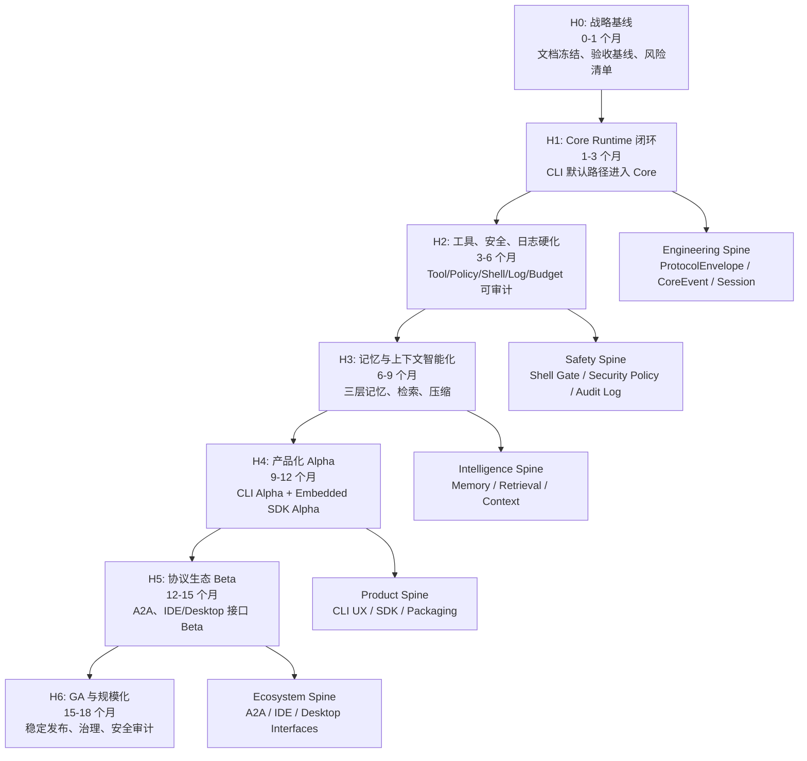
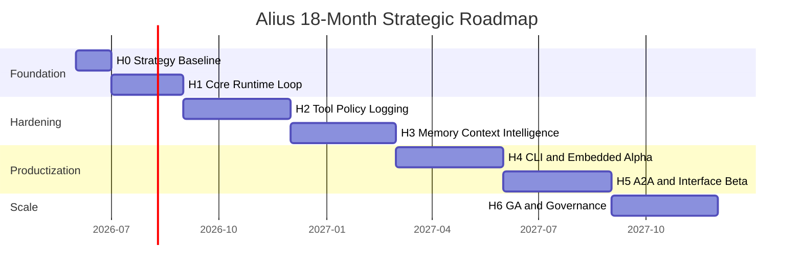

# Alius Strategic Roadmap

更新时间: 2026-06-04 22:40

## 定位

本文是 Alius 的中长期战略规划图，用于把大型项目拆成可执行的研发阶段。它不是模块实现依据；具体实现仍以 `SPEC.md`、`docs/products/`、`docs/interfaces/`、`docs/modules/`、`docs/overview/` 和 `docs/standards/` 为准。

Roadmap 的作用:

- 给出 18 个月左右的战略方向。
- 明确阶段目标、依赖、交付物和退出条件。
- 帮助后续拆研发计划、里程碑、Sprint、Owner 和风险项。
- 避免把规划产品、接口规划和已实现能力混在一起。

## 战略目标

Alius 的中长期目标是成为一个以 workspace 为边界、以 Core Runtime 为中心、可扩展到 CLI、嵌入式 SDK、A2A 协作和未来 IDE/Desktop 的工程 Agent 平台。

核心判断:

- CLI 是当前主产品，必须先完成默认路径的 Core Runtime 收敛。
- Protocol Interface Layer 是长期可扩展性的关键，所有产品入口都必须走统一协议语义。
- Core Runtime 是项目护城河，必须先把 session、tool、memory、policy、budget、logging、trace 做成可观察、可测试的主路径。
- Embedded SDK 是第二产品形态，需要明确 Core Lite 和 FFI 边界。
- Desktop 和 IDE 在当前工程中只做接口规划，不在近期抢占 Core Runtime 资源。
- A2A 是生态入口，但必须建立在本地 Core、权限、Session Manager 和 Agent Card 稳定之后。

## 总体战略图



## 时间轴



## 阶段规划

| 阶段 | 周期 | 战略主题 | 关键结果 |
| --- | --- | --- | --- |
| H0 | 0-1 个月 | 战略基线 | 文档冻结、风险清单、验收基线、研发 Backlog |
| H1 | 1-3 个月 | Core Runtime 闭环 | CLI/TUI 默认路径进入 Core Public API，统一 CoreEvent stream |
| H2 | 3-6 个月 | 工具、安全、日志硬化 | Tool Executor、Shell Gate、Security Policy、Logging、Budget 可审计 |
| H3 | 6-9 个月 | 记忆与上下文智能化 | 三层记忆、混合检索、Context Manager、Compression Worker 可用 |
| H4 | 9-12 个月 | 产品化 Alpha | CLI Alpha 稳定，Embedded SDK Alpha 输出 FFI/Core Lite |
| H5 | 12-15 个月 | 协议生态 Beta | A2A Beta，IDE/Desktop 接口 Beta，Agent Card 发布流程 |
| H6 | 15-18 个月 | GA 与规模化 | 版本治理、安全审计、兼容矩阵、发布体系和团队协作流程稳定 |

## H0: 战略基线

目标:

- 把当前 workspace docs 变成可研发拆解的基线。
- 建立“实现状态、规划状态、风险状态”的分层视图。
- 把 Roadmap 转换为工程 backlog。

必须完成:

- 冻结 `SPEC.md`、`docs/modules/`、`docs/interfaces/` 的 v10 基线。
- 给每个 F-001 到 F-015 建立 Epic。
- 建立验收矩阵: 功能、接口、测试、文档、风险。
- 明确默认 CLI/TUI 当前路径和目标 Core Runtime 主路径之间的差距。
- 建立 CI / 本地检查标准: format、check、lint、test。

退出条件:

- 每个 SPEC 功能点都有 Epic ID、Owner、验收标准和风险等级。
- 每个 Core Runtime 模块都有对应实现任务。
- Roadmap 不再被当作唯一需求源。

## H1: Core Runtime 闭环

目标:

- 让 Alius CLI/TUI 的默认执行路径从产品层进入 Protocol Interface Layer，再进入 Core Public API。
- 建立 session、turn、run、trace 的统一生命周期。

必须完成:

- `ProtocolEnvelope`、`CoreRequest`、`CoreCommand`、`CoreEvent`、`ProtocolError` 的 Rust 契约。
- Direct Rust API Adapter。
- Core Public API MVP: `run`、`command`、`inspect`、`list_sessions`。
- Session Manager MVP: workspace、session、turn、run、trace。
- Agent Engine MVP: prompt -> model -> event stream -> final result。
- Logging Manager MVP: 固定路径 `.alius/memory/logs/`，runtime/error/audit 基础写入。
- CLI/TUI 默认路径切换到 CoreEvent stream。

退出条件:

- `alius` 或 `alius repl` 能通过 Core Public API 完成一次完整 turn。
- TUI 不直接消费 provider stream。
- 每次 run 有 session_ref、run_ref、trace_id。
- 关键错误能进入 error log。

## H2: 工具、安全、日志硬化

目标:

- 把所有工具调用纳入统一 tool-call loop。
- 让本地文件、shell、git、MCP、workflow 都能被审计、限制和追踪。

必须完成:

- Tool Executor 统一入口。
- Shell Gate MVP: 命令解析、cwd、参数、路径、glob、symlink、重定向检查。
- Security And Policy Manager MVP: origin、capability_scope、approval、deny。
- Budget Manager MVP: token、时间、工具调用、连续失败熔断。
- Storage Manager trace/log 查询。
- MCP tools 合并进统一 ToolRegistry 或 ToolDefinition 体系。
- Workflow Engine 接入 Tool Executor，而不是自建执行路径。

退出条件:

- shell/process/git 调用不能绕过 Shell Gate。
- `rm -rf` 类 destructive 命令有拒绝测试。
- workspace 外读写触发 approval required 或 deny。
- tool call 有完整 trace、audit log 和 budget 记录。

## H3: 记忆与上下文智能化

目标:

- 让 Alius 从“会话工具”升级为“理解工程长期上下文的 Agent Runtime”。

必须完成:

- Episodic Memory: session、turn、event、tool、decision 时间线。
- Semantic Memory: workspace docs、项目事实、架构决策、文档 chunk。
- Procedural Memory: 流程、规则、playbook、失败模式。
- Retrieval Engine: keyword + vector hybrid retrieval。
- Context Manager: 检索结果、当前 turn、workspace 文档、用户输入的上下文组织。
- Compression Worker: 长 session 摘要、source map、压缩预算。
- retention/privacy policy: 用户输入原文、摘要、引用、脱敏规则。

退出条件:

- `.alius/workspace/` 文档可被语义索引并检索。
- 一次 turn 可召回相关 memory，并在 CoreEvent 中可观察。
- semantic 不可用时可降级到 keyword retrieval。
- 情景记忆不是原始聊天 dump，保存策略可配置。

## H4: CLI 与 Embedded SDK 产品化 Alpha

目标:

- 把 Core Runtime 能力转化为稳定产品体验。
- 同时验证完整 Core 和 Core Lite 两条产品路径。

CLI Alpha 必须完成:

- `alius init` 创建完整 `.alius/config`、`.alius/memory`、`.alius/workspace`。
- `alius config show/validate` 读取 split config。
- TUI 工作区展示 session、plan、tool approval、logs、memory references。
- `/session`、`/memory`、`/review`、`/model`、`/config` 与 Core Runtime 对齐。
- 本地日志和 trace 查询入口。

Embedded SDK Alpha 必须完成:

- `embedded-sdk` feature 裁剪。
- C ABI FFI lifecycle: init、configure、run/poll、cancel、free、shutdown。
- Core Lite 只保留 minimal config、remote model、light memory cache。
- 禁用 shell、本地工具、LanceDB、本地 embedding、plugin runtime。

退出条件:

- CLI 可用于真实工程的日常开发试用。
- Embedded SDK 能在 C/C++ harness 中跑通最小请求。
- 完整 Core 和 Core Lite 的 feature 边界有测试。

## H5: A2A 与接口生态 Beta

目标:

- Alius 从本地工程 Agent 扩展为可协作 Agent 平台。
- 但 IDE/Desktop 仍以接口 Beta 和规划为主，不抢 Core Runtime 主线资源。

必须完成:

- A2A Adapter Beta: Agent Card export、task mapping、event mapping、remote registry。
- `soul.toml` 到 Agent Card JSON 的发布导出流程。
- RemoteA2A 默认最小权限，不继承 LocalTui 权限。
- JSON-RPC Adapter Beta: Desktop 接口 contract 验证。
- Plugin RPC Adapter Beta: IDE 文件、选区、diagnostics 输入 contract 验证。
- capability matrix 自动测试。

退出条件:

- A2A task 可映射为 CoreRequest 并返回 CoreEvent。
- Agent Card 可以从 `.alius/config/soul.toml` 导出。
- IDE/Desktop 接口有 contract test，但不承诺产品 UI 交付。

## H6: GA 与规模化

目标:

- 形成稳定发布、团队研发、外部协作和长期维护能力。

必须完成:

- 版本治理: semver、feature matrix、migration guide。
- 安全治理: Shell Gate 审计、权限默认值、安全测试集。
- 质量治理: contract tests、integration tests、snapshot tests、CLI smoke tests。
- 发布治理: CLI release、SDK artifact、docs package、example projects。
- 兼容治理: legacy config/memory migration、workspace archive workflow。
- 运营治理: issue template、PR template、release checklist、性能基准。

退出条件:

- `master` 始终可构建、可测试、可发布。
- CLI 有稳定用户路径和明确错误诊断。
- SDK 有稳定 ABI 文档和兼容策略。
- A2A/IDE/Desktop 接口有版本化协议 contract。

## 并行工作流

| 工作流 | 贯穿阶段 | 责任边界 |
| --- | --- | --- |
| Runtime | H1-H6 | Core Public API、Session、Agent Engine、CoreEvent |
| Safety | H2-H6 | Security Policy、Shell Gate、Budget、Audit Log |
| Memory | H3-H6 | 三层记忆、Retrieval、Context、Compression |
| Product | H4-H6 | CLI/TUI、Embedded SDK、使用流程、文档 |
| Ecosystem | H5-H6 | A2A、IDE、Desktop 接口、Agent Card |
| Quality | H0-H6 | CI、本地检查、测试矩阵、发布门禁 |

## 研发计划拆解规则

每个阶段拆研发计划时，按以下层级拆:

```text
Strategic Horizon
-> Phase
-> Epic
-> Milestone
-> Sprint Goal
-> Task
-> Test / Acceptance
```

每个 Epic 必须包含:

- 对应 SPEC 功能点。
- 对应 module/interface/product 文档路径。
- 目标用户或调用方。
- 输入/输出契约。
- 依赖模块。
- 验收命令或测试策略。
- 风险和回滚方案。

## 决策门禁

| 决策点 | 进入下一阶段前必须回答 |
| --- | --- |
| H0 -> H1 | 默认 CLI/TUI 当前路径和目标 Core 路径差距是否清楚 |
| H1 -> H2 | CoreEvent stream 是否支撑工具审批、取消、错误和最终结果 |
| H2 -> H3 | 工具和 shell 是否已无法绕过 policy/audit |
| H3 -> H4 | memory/context 是否能稳定提升真实工程任务 |
| H4 -> H5 | CLI Alpha 和 SDK Alpha 是否已暴露足够稳定的 Core contract |
| H5 -> H6 | A2A/IDE/Desktop 接口是否有版本化 contract 和权限矩阵 |

## 关键风险

| 风险 | 影响 | 控制策略 |
| --- | --- | --- |
| 过早做 Desktop/IDE UI | 分散 Core Runtime 资源 | H5 前只做接口 contract，不做产品 UI |
| A2A 先于本地权限成熟 | 远端能力边界失控 | RemoteA2A 默认最小权限，必须依赖 Security Policy |
| Memory 被做成聊天日志 | 检索质量低且有隐私风险 | Episodic 记录事件线，原文保存受 retention policy 控制 |
| Tool 执行绕过 Shell Gate | 高风险破坏 workspace | 所有 shell/process/git 入口集中到 Tool Executor -> Shell Gate |
| Roadmap 替代 SPEC | 研发任务失焦 | Roadmap 只做战略规划，研发计划必须引用 SPEC/docs |
| feature 裁剪不彻底 | Embedded SDK 产物过重 | 依赖树和 feature matrix 纳入 CI |

## 成功指标

| 维度 | 指标 |
| --- | --- |
| Runtime | 100% 产品入口经 Protocol Interface Layer 进入 Core Public API |
| Safety | 100% shell/process/git 调用有 Shell Gate decision |
| Observability | 每个 run 可按 trace_id 查询 logs、events、tool calls、budget |
| Memory | workspace docs 可索引，检索失败有降级路径 |
| Product | CLI Alpha 可支撑真实工程任务，SDK Alpha 可被 C harness 调用 |
| Ecosystem | A2A task 可稳定映射到 CoreRequest，Agent Card 可导出 |
| Engineering | PR 前 format/check/lint/test 有记录，master 可发布 |

## 近期研发计划建议

建议第一个可执行研发周期按 6 周拆:

| 周期 | 目标 | 输出 |
| --- | --- | --- |
| Week 1 | 现状审计与 Backlog | 默认路径审计、模块差距表、Epic 列表 |
| Week 2 | Protocol Contract | `ProtocolEnvelope`、CoreRequest/CoreCommand/CoreEvent draft |
| Week 3 | Core Public API MVP | `run`、`command`、`inspect` 基础骨架 |
| Week 4 | Session Manager MVP | workspace/session/turn/run/trace 生命周期 |
| Week 5 | CLI/TUI 接入 CoreEvent | 默认路径替换或灰度开关 |
| Week 6 | Logging MVP 和验收 | 固定日志路径、error/audit log、smoke test |

第一期完成后，再进入 H2 的 Tool/Shell/Policy 硬化。
