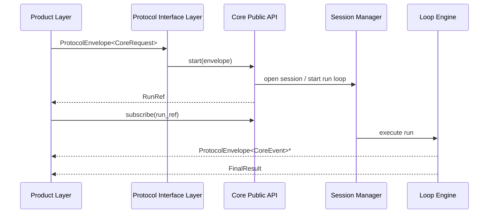

# Core Runtime API Contract

更新时间: 2026-06-05 20:00

## 职责

Core Runtime API 是协议接口层进入核心运行时的唯一公开接口。它只接收协议层提交的 `ProtocolEnvelope<CoreRequest>` 和 `ProtocolEnvelope<CoreCommand>`，并输出统一 `CoreEvent` stream。

## 代码契约

trait 定义在 `protocol/src/core.rs`，实现在 `runtime/core/src/runtime.rs`。

```rust
pub trait CoreRuntimeApi {
    type EventStream;

    // Turn 执行
    fn start(&self, envelope: ProtocolEnvelope<CoreRequest>) -> Result<RunRef, ProtocolError>;
    fn send(&self, envelope: ProtocolEnvelope<CoreCommand>) -> Result<(), ProtocolError>;
    fn subscribe(&self, run_ref: &RunRef) -> Result<Self::EventStream, ProtocolError>;

    // Session 管理
    fn inspect(&self, session_ref: &SessionRef) -> Result<SessionSnapshot, ProtocolError>;
    fn list_sessions(&self, workspace_ref: &WorkspaceRef) -> Result<Vec<SessionSummary>, ProtocolError>;
    fn close_session(&self, session_ref: &SessionRef) -> Result<(), ProtocolError>;
    fn clear_conversation(&self, session_ref: &SessionRef) -> Result<(), ProtocolError>;

    // Config
    fn config_read(&self) -> Result<ConfigSnapshot, ProtocolError>;
    fn config_validate(&self) -> Result<ValidationResult, ProtocolError>;
    fn config_update(&self, key: &str, value: serde_json::Value) -> Result<(), ProtocolError>;
    fn model_list(&self) -> Result<Vec<ModelInfo>, ProtocolError>;

    // Memory
    fn memory_save(&self, text: &str, tags: Vec<String>) -> Result<(), ProtocolError>;
    fn memory_list(&self) -> Result<Vec<MemoryEntry>, ProtocolError>;
    fn memory_clear(&self) -> Result<(), ProtocolError>;

    // Tool
    fn tool_list(&self) -> Result<Vec<ToolInfo>, ProtocolError>;

    // Review
    fn review_start(&self, session_ref: &SessionRef) -> Result<RunRef, ProtocolError>;

    // Health
    fn health_check(&self) -> Result<HealthReport, ProtocolError>;

    // Logging
    fn query_logs(&self, query: LogQuery) -> Result<Vec<LogRecord>, ProtocolError>;
}
```

## Turn 执行 API

### start

```text
start(envelope: ProtocolEnvelope<CoreRequest>) -> Result<RunRef, ProtocolError>
```

职责: 校验协议版本、origin、capability_scope；创建或恢复 session；创建 turn/run/trace；返回 `RunRef`。

错误: UnsupportedVersion, InvalidMessage, CapabilityDenied, WorkspaceMismatch, Internal

### send

```text
send(envelope: ProtocolEnvelope<CoreCommand>) -> Result<void, ProtocolError>
```

职责: 向运行中的 run 发送控制命令（取消、审批、拒绝、继续、暂停、Plan 审批、模型切换等）。

错误: RunNotFound, Conflict, CapabilityDenied, InvalidMessage

### subscribe

```text
subscribe(run_ref: RunRef) -> Result<EventStream, ProtocolError>
```

职责: 订阅某个 run 的 `CoreEvent` stream。TUI、CLI、A2A、JSON-RPC 都应消费同一语义。

错误: RunNotFound, Internal

## Session 管理 API

### inspect

```text
inspect(session_ref: SessionRef) -> Result<SessionSnapshot, ProtocolError>
```

职责: 查询 session 状态，返回 turn/run/trace 摘要。

错误: SessionNotFound, WorkspaceMismatch

### list_sessions

```text
list_sessions(workspace_ref: WorkspaceRef) -> Result<Vec<SessionSummary>, ProtocolError>
```

职责: 列出当前 workspace 下 sessions。不允许跨 workspace 聚合。

错误: WorkspaceMismatch, Internal

### close_session

```text
close_session(session_ref: SessionRef) -> Result<void, ProtocolError>
```

职责: 关闭 session，标记状态为 Closed。

错误: SessionNotFound

### clear_conversation

```text
clear_conversation(session_ref: SessionRef) -> Result<void, ProtocolError>
```

职责: 清空当前 session 对话历史，session 保持 Open。

错误: SessionNotFound

## Config API

### config_read

```text
config_read() -> Result<ConfigSnapshot, ProtocolError>
```

返回当前运行时配置快照（provider、model、base_url、soul、has_api_key）。

### config_validate

```text
config_validate() -> Result<ValidationResult, ProtocolError>
```

校验配置完整性（provider、model、API key 是否齐全）。

### config_update

```text
config_update(key: &str, value: serde_json::Value) -> Result<void, ProtocolError>
```

更新配置项。支持 provider、model、base_url、api_key、soul、language。

错误: InvalidMessage（key 不合法或 value 格式错误）

### model_list

```text
model_list() -> Result<Vec<ModelInfo>, ProtocolError>
```

列出当前 provider 可用模型。需要调用 provider API。

## Memory API

### memory_save

```text
memory_save(text: &str, tags: Vec<String>) -> Result<void, ProtocolError>
```

保存记忆条目。

### memory_list

```text
memory_list() -> Result<Vec<MemoryEntry>, ProtocolError>
```

列出记忆条目。

### memory_clear

```text
memory_clear() -> Result<void, ProtocolError>
```

清空记忆。

## Tool API

### tool_list

```text
tool_list() -> Result<Vec<ToolInfo>, ProtocolError>
```

列出可用工具（BuiltIn、MCP、Plugin）。

## Review API

### review_start

```text
review_start(session_ref: SessionRef) -> Result<RunRef, ProtocolError>
```

对上一次 assistant 响应发起 code review。返回 review 的 RunRef，事件通过 subscribe 消费。

## Health API

### health_check

```text
health_check() -> Result<HealthReport, ProtocolError>
```

系统健康检查（config_ok、api_reachable、workspace_ok）。

## Logging API

### query_logs

```text
query_logs(query: LogQuery) -> Result<Vec<LogRecord>, ProtocolError>
```

按 workspace、session、run、trace、level 查询日志。日志路径固定为 `.alius/memory/logs/`。

## 辅助类型

| 类型 | 字段 | 用途 |
| --- | --- | --- |
| `ConfigSnapshot` | provider, model, base_url, soul, has_api_key | 运行时配置快照 |
| `ValidationResult` | valid, errors | 配置校验结果 |
| `ModelInfo` | id, name | provider 模型信息 |
| `MemoryEntry` | id, content, tags, created_at | 记忆条目 |
| `ToolInfo` | name, description, source | 工具信息 |
| `ToolSource` | BuiltIn / Mcp / Plugin | 工具来源 |
| `HealthReport` | config_ok, api_reachable, workspace_ok, errors | 健康检查报告 |

## CoreEvent stream 规则



输出顺序要求:

1. `SessionOpened` 或 session 恢复事件。
2. `TurnStarted`。
3. 0..N 个 model/tool/policy/budget/memory/log/error 事件。
4. 必须以 `FinalResult` 或 `ErrorRaised` 结束。

## Session API 语义

- `workspace_ref` 决定工程范围。
- `session_ref` 决定开发轮次、功能开发、修复、review 或长期任务。
- `turn_ref` 决定 session 内一次用户输入。
- `run_ref` 决定一次可取消、可审批、可查询的执行实例。
- `trace_id` 贯穿 run、event、log、error。

## 当前阶段实现状态

| 项目 | 状态 |
| --- | --- |
| `CoreRuntimeApi` trait 定义 | 已完成（20 方法） |
| 协议对象 serde | 已有单元测试覆盖 |
| `RunLoop` 空输入拒绝 | 已有单元测试覆盖 |
| 兼容 `StartTurn` 空输入拒绝 | 已有单元测试覆盖 |
| `CoreRuntime` 实现 start/send/subscribe/inspect/list_sessions | 已完成（`runtime/core/`） |
| Session Manager MVP | 已完成（`runtime/core/`） |
| EventAdapter 投影事件 → CoreEvent | 已完成（`runtime/core/`） |
| Config/Memory/Tool/Review/Health 方法 | 已实现（接入 MemoryStore、ToolRegistry、ConversationStore） |
| query_logs | 已实现（基于 SessionManager 事件查询） |
| ProtocolInterface 12 个非 start 委托方法 | 已实现（含能力检查） |
| CLI /memory、/tools、/review、/session clear 走协议层 | 已完成（通过 ProtocolBridge） |
| 默认 CLI/TUI 完整接入 CoreEvent stream | 未完成，H1 第二期任务 |
| Logging Manager MVP（结构化 JSONL 持久化） | 未完成，H1/H2 任务 |

## 验收标准

- CLI、IDE、Desktop、A2A 都能消费 CoreEvent 语义。
- run 可取消、审批和查询。
- 日志、trace、error 可关联同一个 trace_id。
- 默认 CLI/TUI 路径不得直接绕过 Core Public API。
- Core Public API 实现必须满足 `protocol_interface::CoreRuntimeApi`。
