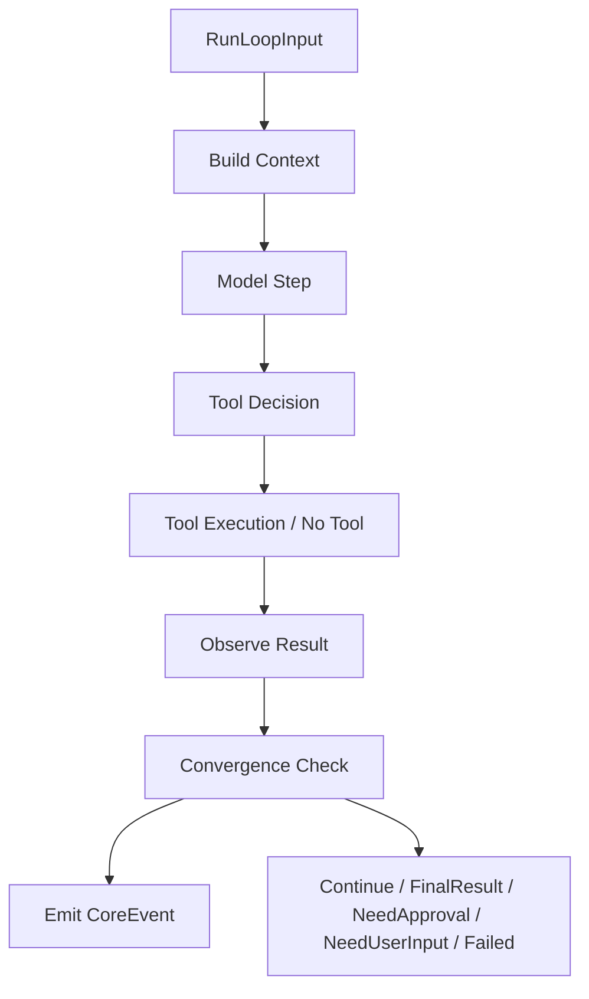

# Loop Engine

更新时间: 2026-06-05 03:24

## 模块职责

Loop Engine 是 Core Runtime 内统一的循环执行引擎。普通聊天和 Plan 模式不再走两套执行路径，而是都进入 Loop Engine，并通过 `LoopPolicy` 控制轮数、工具、规划和收敛判断。

输入:

- `RunLoopInput`
- `RuntimeMode`
- `LoopPolicy`
- session / run / trace context

输出:

- `RunStarted`
- `LoopIterationStarted`
- `ModelDelta`
- `ToolCallRequested`
- `ToolCallStarted`
- `ToolCallCompleted`
- `ConvergenceChecked`
- `NeedApproval`
- `NeedUserInput`
- `FinalResult`
- `ErrorRaised`

## 代码位置

```text
runtime/core/src/loop_engine/
├── mod.rs
├── engine.rs
├── policy.rs
├── iteration.rs
├── convergence.rs
├── planner.rs
├── model_step.rs
├── tool_step.rs
└── result.rs
```

## 接口定义

```text
LoopEngine::input_from_request(input: &RequestInput) -> RunLoopInput
```

将 legacy `Text` 输入和新的 `RunLoop` 输入统一转换为 `RunLoopInput`。

```text
LoopEngine::run_stub(run_ref, trace_id, input) -> LoopExecutionResult
```

当前最小生命周期实现，用于落地统一事件结构。后续真实 Agent Loop 必须替换该 stub。

```text
check_convergence(iteration, model_finished) -> ConvergenceReport
```

每轮 loop 结束后必须输出收敛判断。

## 策略

### ChatPolicy

```text
max_iterations = 1
tools_enabled = false
planning_enabled = false
require_convergence_check = true
require_approval_for_tools = false
```

普通聊天仍进入 loop，但只执行一轮模型响应，然后立即收敛。

### PlanPolicy

```text
max_iterations = 20
tools_enabled = true
planning_enabled = true
require_convergence_check = true
require_approval_for_tools = true
```

Plan 模式进入多轮 loop，每轮执行 plan / model / tool / observe / convergence check。

## 内部逻辑



## 数据存储

当前最小实现不直接持久化。Loop 事件由 Core Runtime 交给 Session Manager 和后续 Logging Manager / Storage Manager 处理。

后续真实实现需要写入:

- session event timeline。
- tool execution trace。
- convergence decision trace。
- runtime/error/audit logs。

## 异常处理

- 空输入: 由 `CoreRequest::run_loop` 和 `CoreRequest::validate` 拒绝。
- 达到 `max_iterations`: 输出 `ConvergenceDecision::MaxIterationsReached`。
- 需要用户确认: 输出 `NeedApproval`。
- 需要用户补充信息: 输出 `NeedUserInput`。
- 工具失败且无法恢复: 输出 `Failed`。

## 与其他模块的关系

- 上游: Core Runtime。
- 下游: Model Router、Tool Executor、Shell Gate、Memory System、Logging Manager。
- 协议来源: `protocol-interface::RunLoopInput`、`RuntimeMode`、`LoopPolicy`、`ConvergenceDecision`。
- 产品来源: REPL `ReplMode` 映射到 `RuntimeMode`。

## 验收标准

- Chat 和 Plan 都能表示为 `CoreRequest::RunLoop`。
- ChatPolicy 固定 `max_iterations = 1` 且默认关闭工具。
- PlanPolicy 允许多轮、工具、规划和审批。
- 每轮 loop 都产生 `ConvergenceChecked`。
- Core Runtime 不再新增 DirectChat / AgentLoop 两套入口。
