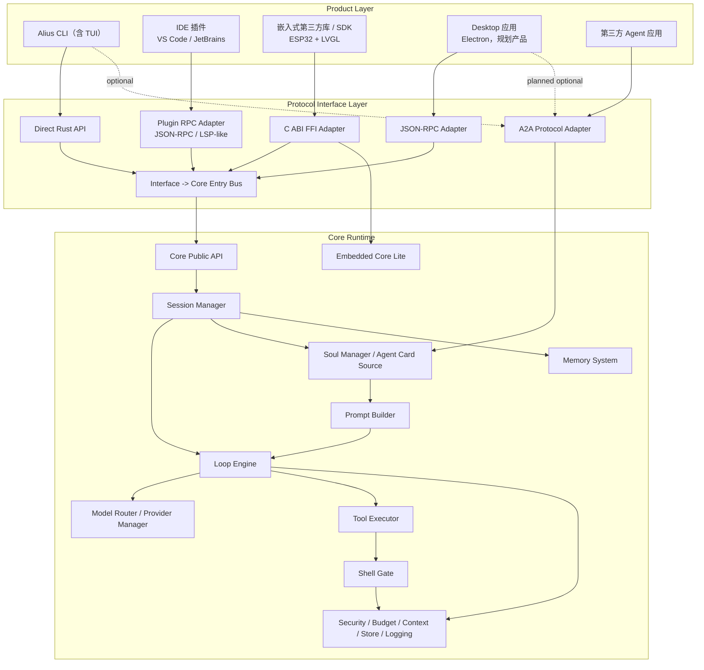

# Alius Architecture Overview

更新时间: 2026-06-05 03:43

## 总体架构

Alius v10 采用三层架构:

```text
Product Layer -> Protocol Interface Layer -> Core Runtime
```

完整 Mermaid 图表和逐项核对表见:

```text
.alius/workspace/docs/overview/DIAGRAMS.md
.alius/workspace/docs/overview/ARCHITECTURE_DETAILS.md
.alius/workspace/docs/overview/ENGINEERING_BASELINE.md
```



## 模块职责

| 层 | 职责 |
| --- | --- |
| Product Layer | 产品体验、输入、渲染，不承载 Core Runtime |
| Protocol Interface Layer | 传输适配、统一 envelope、origin/capability 归一化、Core Gateway |
| Core Runtime | session、loop engine、prompt、memory、model、tool、policy、budget、trace |

## 产品入口映射

| 产品入口 | 主接口 | 备注 |
| --- | --- | --- |
| Alius CLI（含 TUI） | Direct Rust API | 当前主产品；同进程函数调用 |
| IDE 插件 | Plugin RPC Adapter | VS Code / JetBrains；JSON-RPC / LSP-like；stdio / socket |
| 嵌入式第三方库 / SDK | C ABI FFI Adapter | ESP32 + LVGL；只保留 FFI + Core Lite |
| Desktop 应用 | JSON-RPC Adapter | Electron，规划产品；stdio / socket |
| 第三方 Agent 应用 | A2A Protocol Adapter | 通过 A2A 与 Alius 通信 |
| CLI / Desktop 可选 A2A | A2A Protocol Adapter | CLI 通过 `--a2a` / config；Desktop 通过 settings toggle |

## Core Runtime 模块

| 模块 | 说明 | 详细文档 |
| --- | --- | --- |
| Core Public API | 统一核心入口 | `docs/modules/core_runtime.md` |
| Session Manager | Thread / Turn / Context / Task State | `docs/modules/session_manager.md` |
| Loop Engine | 主循环 / Tool-call Loop / Event Stream | `docs/modules/loop_engine.md` |
| Prompt Builder | L1-L5 prompt 组装 | `docs/modules/prompt_builder.md` |
| Soul Manager | Active Soul / Prompt / Policy / Agent Card Source | `docs/modules/soul_manager.md` |
| Memory System | 语义检索 / 记忆召回 / 写回 | `docs/modules/memory_manager/README.md` |
| A2A Adapter | A2A Server + Client / Task Mapper / Remote Registry | `docs/modules/a2a_adapter.md` |
| Model Router | light / medium / high 模型分流 | `docs/modules/model_router.md` |
| Provider Manager | OpenAI / Anthropic / Google / BigModel / Custom | `docs/modules/provider_manager.md` |
| Tool Executor | 文件、环境、会话、协作、MCP、Agent/Task 工具 | `docs/modules/tool_executor.md` |
| Shell Gate | Shell / process / git 命令、参数和作用范围门禁 | `docs/modules/shell_gate.md` |
| Workflow Engine | Plan / Todo / Task Orchestration | `docs/modules/workflow_engine.md` |
| Storage Manager | 配置 / 会话 / 缓存 / Trace / Keychain | `docs/modules/storage_manager.md` |
| Security & Policy Manager | 审批 / 权限 / Sandbox / Allowlist | `docs/modules/security_policy_manager.md` |
| Logging Manager | Runtime / Error / Exception / Audit log | `docs/modules/logging_manager.md` |
| Budget Manager | token / 时间 / 成本 / 工具调用 / 熔断 | `docs/modules/budget_manager.md` |
| Context Manager | 上下文窗口 / 截断 / 摘要 / 引用组织 | `docs/modules/context_manager.md` |
| Compression Worker | 后台压缩上下文，预留 20,000 tokens | `docs/modules/compression_worker.md` |
| Embedded Core Lite | embedded-sdk 裁剪运行时 | `docs/modules/embedded_core_lite.md` |

## 架构图维护方式

架构图使用 Markdown Mermaid 维护，主文件为:

```text
.alius/workspace/docs/overview/DIAGRAMS.md
```

如需导出 PNG / SVG，只能作为发布产物或附件，不能替代 Mermaid 源图。
