# Alius Core Data Flow

更新时间: 2026-06-05 03:43

## 维护方式

本文件使用 Markdown Mermaid 描述核心数据流。文字流程只能作为说明，不能替代 Mermaid 图。

## 场景一: 记忆存储

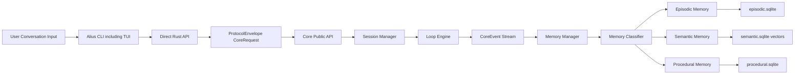

映射规则:

- session、turn、CoreEvent、工具调用、用户决策写入 episodic memory。
- 用户输入原文是否写入 episodic memory 由 retention / privacy policy 决定，默认可保存摘要或引用。
- 稳定项目事实写入 semantic memory。
- 可复用操作流程写入 procedural memory。

## 场景二: 记忆检索

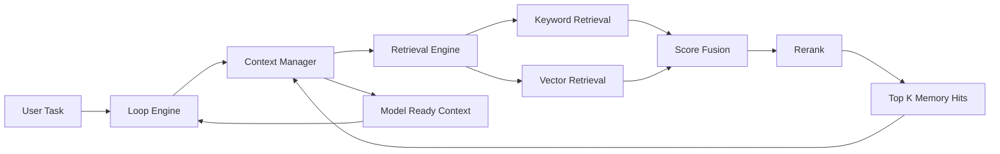

降级策略:

- semantic vector index 不可用时，降级为 keyword retrieval。
- 单层记忆不可用时，其他记忆层继续工作。

## 场景三: 文档更新

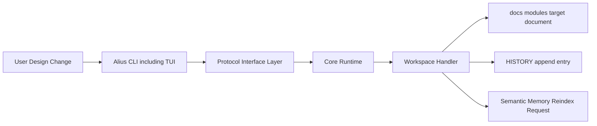

约束:

- `SPEC.md` 是需求源头。
- `docs/modules/` 是模块实现标准。
- 所有文档修改必须能追踪到 `HISTORY.md`。

## 场景四: 产品入口到 Core

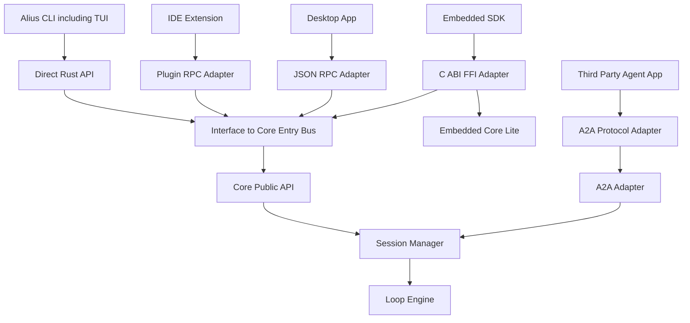

## 场景五: A2A 通信

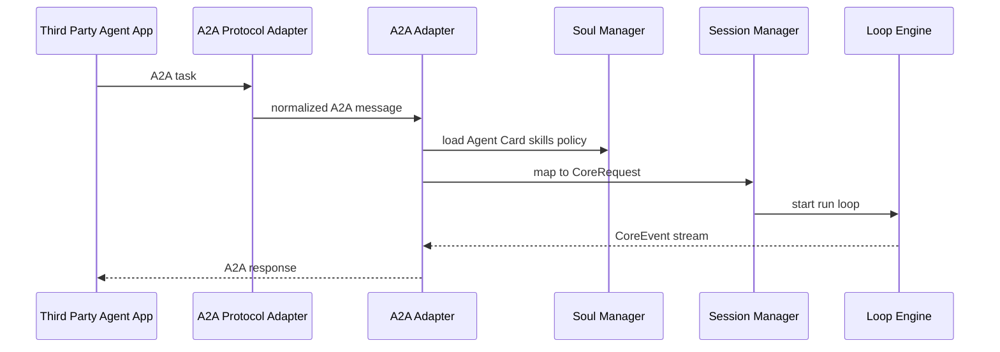

启用策略:

- CLI: `--a2a` / config 可选启用。
- Desktop: settings toggle，规划可选启用。
- 第三方 Agent: A2A 标准入口。
- Embedded SDK: 默认关闭。

## 场景六: 模型调用

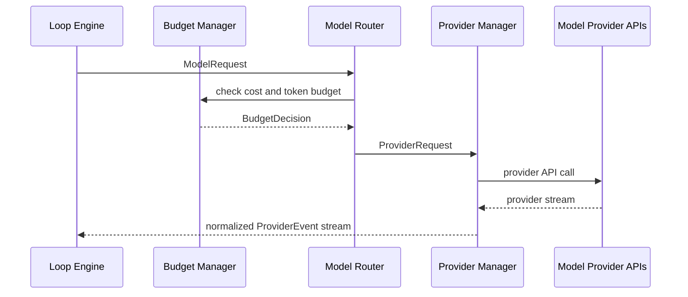

## 场景七: 工具调用

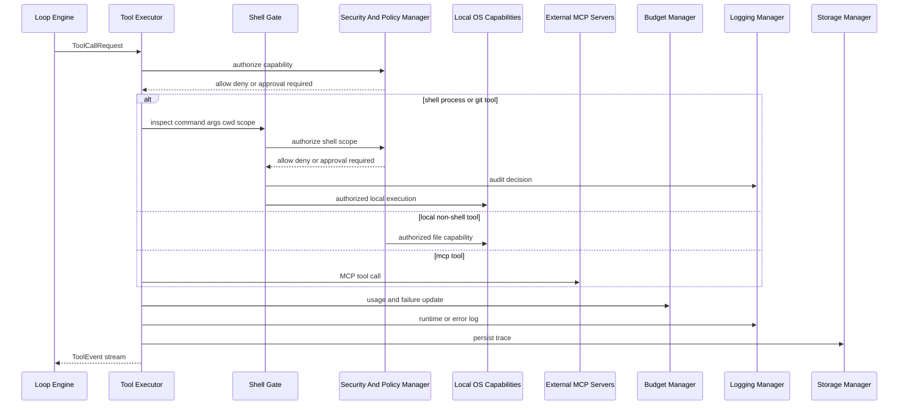

工具范围:

- Read / Edit / Write / Grep。
- Bash / WebFetch / WebSearch。
- AskUserQuestion / Plan / Todo。
- Agent / Task / MCP Resource。

## 场景八: Shell 门禁

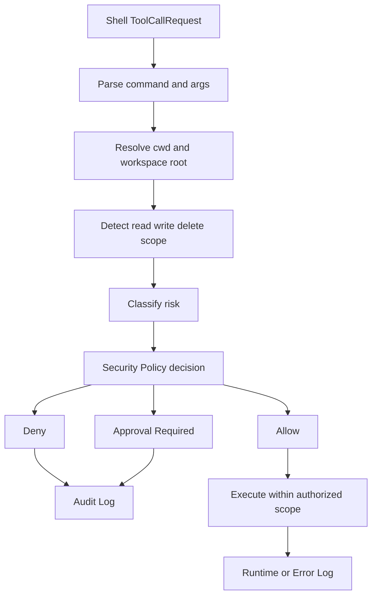

规则:

- `rm -rf` 类 critical destructive 命令默认拒绝或强制审批。
- cwd、参数、glob、symlink、重定向和 `bash -c` 都必须纳入作用范围分析。
- 读写 workspace 外路径必须授权。
- 无法确定作用范围时，不自动允许。

## 场景九: 运行日志

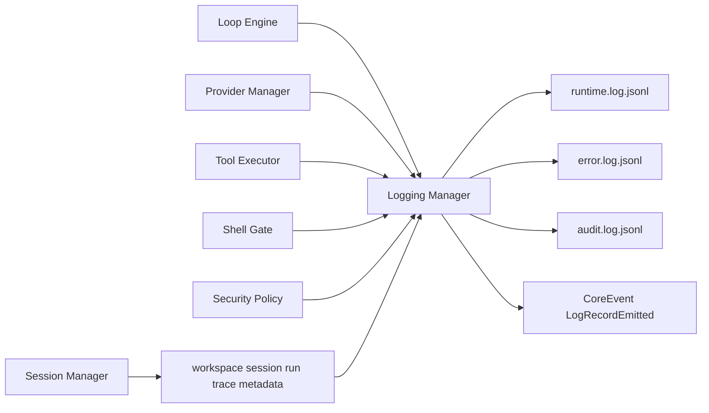

要求:

- runtime、error、exception、audit 日志实时记录。
- error、exception、audit 必须立即 flush。
- 日志必须脱敏 API key、token、Authorization header 和敏感用户输入。

## 场景十: 上下文压缩

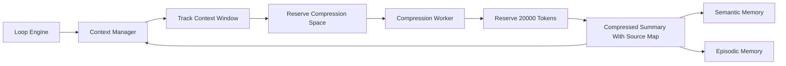

## 场景十一: 预算和熔断

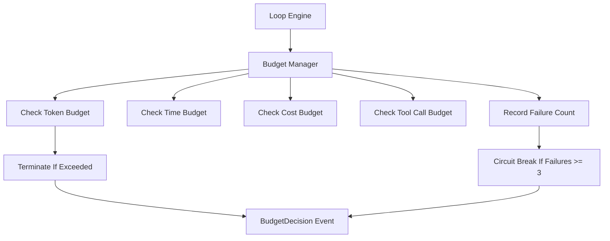

## 场景十二: 构建与 Feature 裁剪

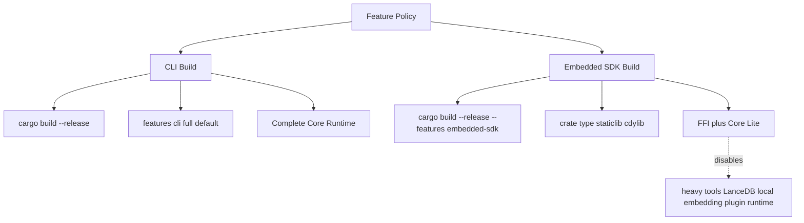
