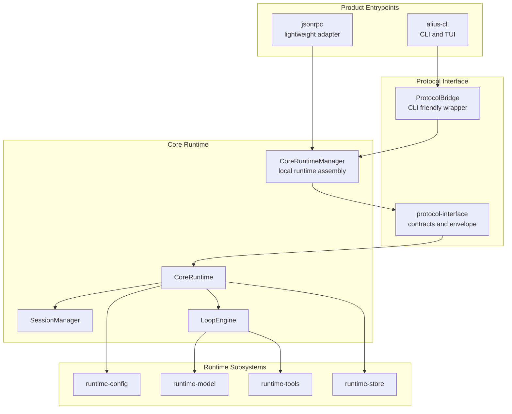
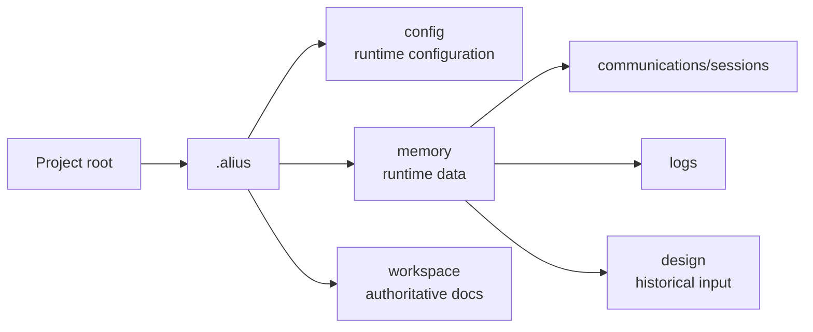

# Diagrams

This file is the maintained Mermaid source for high-level workspace diagrams.

## Main Architecture



## Request and Event Flow

```mermaid
sequenceDiagram
  participant Product
  participant Manager as CoreRuntimeManager
  participant Protocol as Protocol Interface
  participant Core as CoreRuntime
  participant Session as SessionManager
  participant Loop as LoopEngine
  participant Model as LlmClient

  Product->>Manager: run_text or start_streaming
  Manager->>Protocol: ProtocolEnvelope<CoreRequest>
  Protocol->>Protocol: validate version and capability ceiling
  Protocol->>Core: start request
  Core->>Session: create session or turn
  Core->>Loop: run Chat, Bypass, or Plan mode
  Loop->>Model: model request
  Model-->>Loop: model deltas
  Loop-->>Core: CoreEvent values
  Core-->>Protocol: run ref and events
  Protocol-->>Product: CoreEvent stream or wrapped events
```

## Project State


