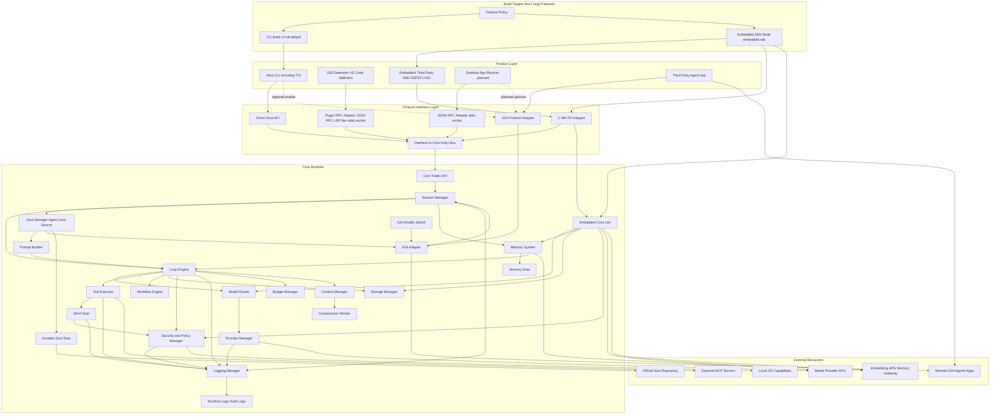
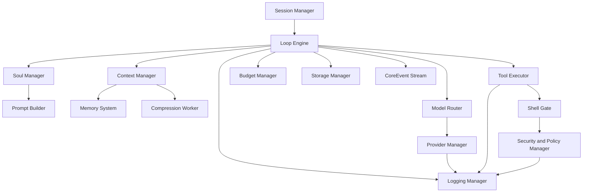
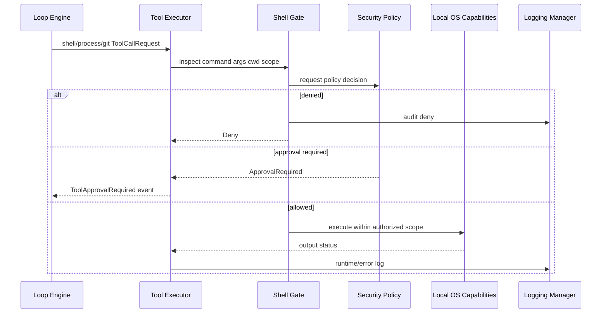
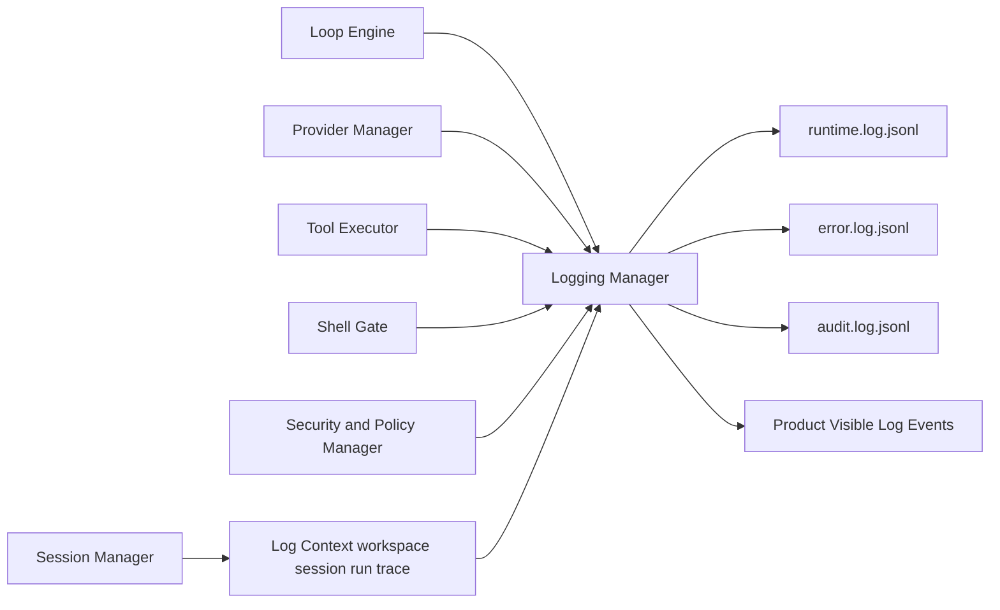
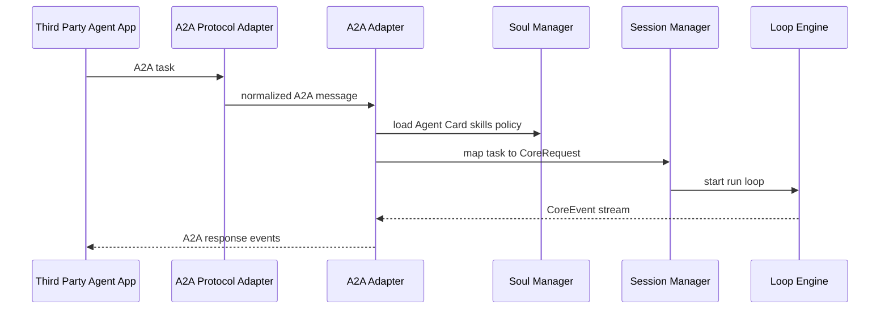
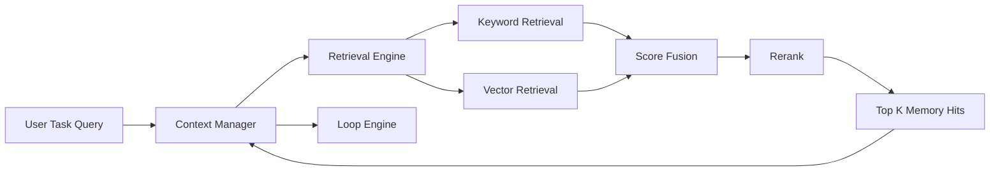
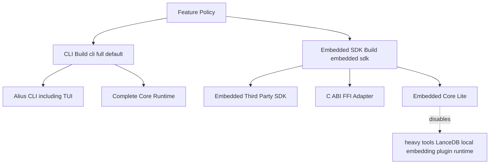
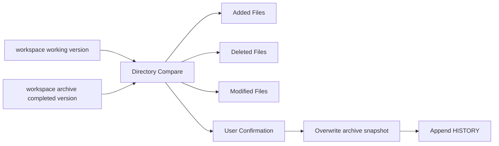

# Mermaid Diagram Catalog

更新时间: 2026-06-05 03:43

## 定位

本文件是 workspace 中架构图、流程图和构建关系图的 Markdown Mermaid 源文件。后续不再以外部绘图文件或图片文件作为设计图主来源。

## Mermaid ID 规范

- Product Layer 节点使用 `p_*`。
- Protocol Interface Layer 节点使用 `i_*`。
- Core Runtime 节点使用 `c_*`、`m_*`、`d_*`。
- External Resources 节点使用 `x_*`。
- Build / Feature 节点使用 `b_*`。
- 数据流节点使用 `df_*`。
- 实体关系节点使用大写实体名，详见 `ENTITY_RELATIONSHIP.md`。

## Overall Architecture

## Protocol To Core

```mermaid
flowchart LR
  p_any["Product Entry"] --> i_transport["Transport Adapter"]
  i_transport --> i_envelope["ProtocolEnvelope"]
  i_envelope --> i_origin["Origin Capability Normalizer"]
  i_origin --> interface_bus["Interface to Core Entry Bus"]
  interface_bus --> c_coreapi["Core Public API"]
  c_coreapi --> c_session["Session Manager"]
  c_session --> c_engine["Loop Engine"]
```

## Core Runtime Loop

## Shell Command Gate Flow

## Runtime Logging Flow

## A2A Flow

## Memory Retrieval Flow

## Build And Feature Policy

## Workspace Document Confirmation

