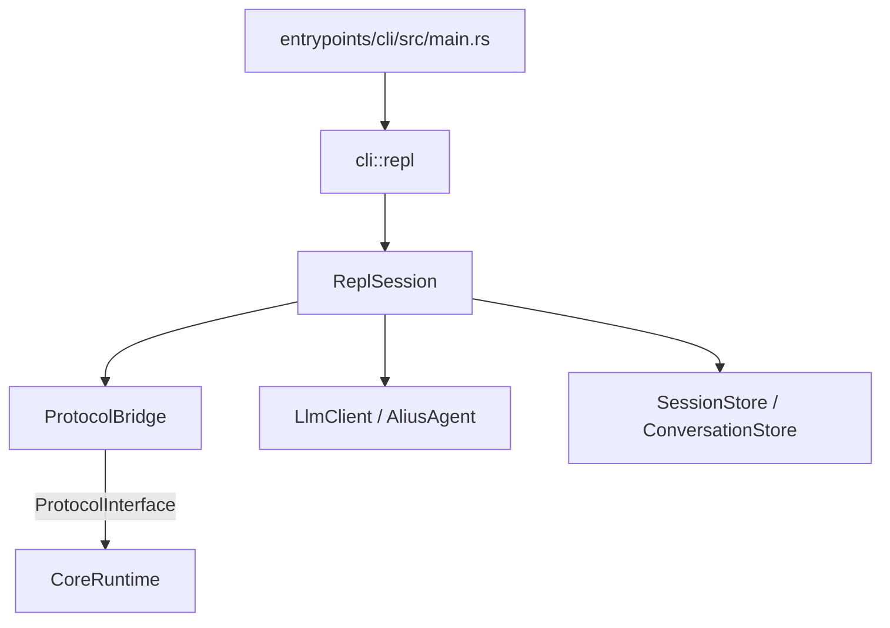
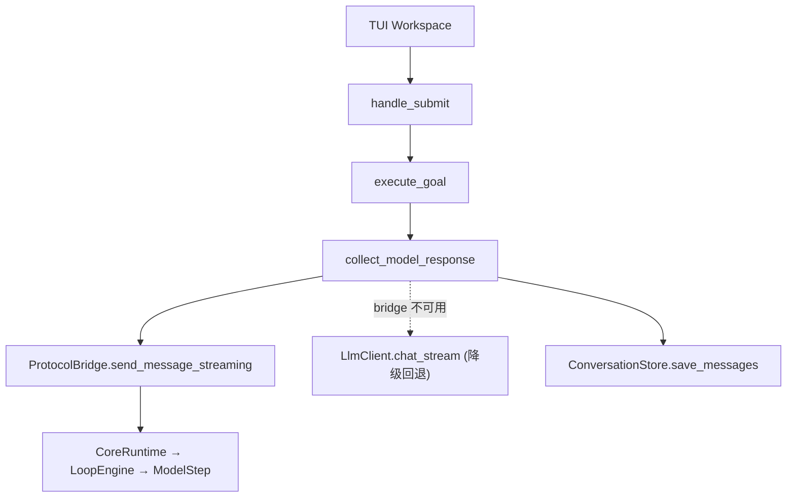
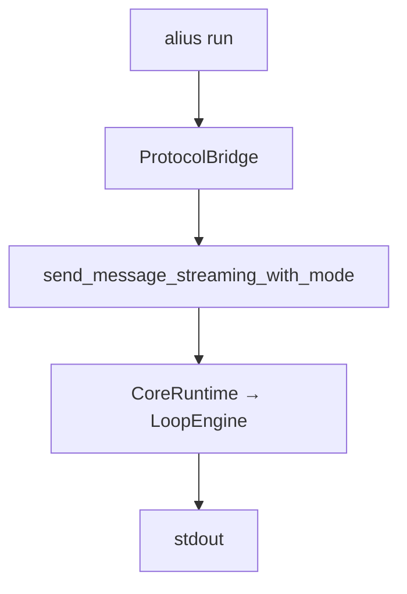
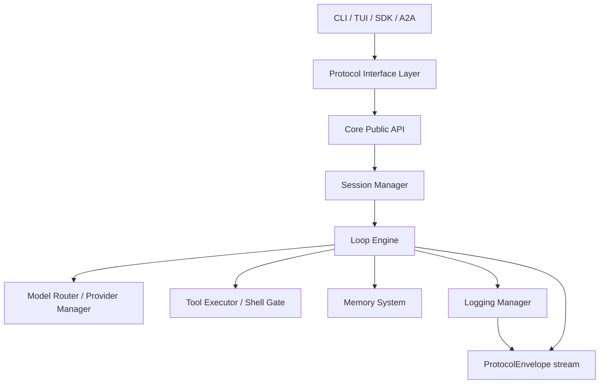

# Engineering Baseline

更新时间: 2026-06-05 20:00

## 文档定位

本文记录 `Phase 0: Architecture Baseline Freeze` 的工程基线。它用于回答“现在从哪里开始实现”，并把当前代码状态、目标主路径、阶段冻结项和下一阶段入口对齐到同一个视图。

实现依据仍以 `SPEC.md`、`docs/interfaces/`、`docs/modules/` 和 `docs/products/` 为准。本文只记录当前阶段的工程事实和验收状态。

## 阶段目标

本阶段目标不是完成功能型 Core Runtime，而是冻结后续研发不可随意漂移的基础契约:

- 明确当前代码路径和目标 Core Runtime 主路径之间的差距。
- 冻结 Product Layer、Protocol Interface Layer、Core Runtime 的边界。
- 在代码中落地最小 Core Runtime 协议契约类型。
- 建立后续 Session Manager、Loop Engine、Logging Manager 接入的起点。
- 明确 H1 研发计划应从哪个可测试入口继续。

## 当前工程事实

### Workspace 状态

当前 workspace 目录为一个确定工程目录。`.alius/` 已按项目配置、记忆和工作区文档拆分:

```text
.alius/
├── config/
├── memory/
└── workspace/
```

`.alius/workspace/` 是工作版本目录，`.alius/workspace/.archive/` 是已完成版本快照目录。文档确认流程见 `docs/standards/WORKSPACE_UPDATE_CONFIRMATION.md`。

### Crates 目标结构

`crates/` 目录已重构为以下工程目录:

```text
.
├── entrypoints/cli/     # cli 产品入口
├── entrypoints/jsonrpc/ # alius-jsonrpc 适配器
├── protocol/            # Protocol Interface
└── runtime/
    ├── core/            # Core Runtime
    ├── config/          # Settings
    ├── model/           # LLM client
    ├── store/           # Storage
    └── tools/           # Tool registry
```

### Crate 基线

| Crate | 当前职责 | 与目标架构关系 | 当前阶段判断 |
| --- | --- | --- | --- |
| `cli` | CLI 入口、命令分发、REPL、TUI workspace、交互命令、UI；内部包含 config/model/store/tools/formula/mcp/plugin/workflow 模块 | Product Layer | 当前主产品；Chat 模式和 /memory、/tools、/review、/session clear 已走协议层；TUI 和 alius run 仍绕过 |
| `jsonrpc` | JSON-RPC 请求/命令/事件序列化适配 | Protocol Interface Layer 传输适配 | 最小 crate 已建立，后续用于 Desktop/外部 RPC 接入 |
| `protocol-interface`（目录 `protocol/`） | 共享协议类型、CoreRuntimeApi、Direct Rust ProtocolInterface 网关 | Protocol Interface Layer 契约来源 | 已合并原协议类型和 Direct Rust API 网关，12 个委托方法已实现 |
| `core-runtime`（目录 `runtime/core/`） | Core Runtime 实现入口、Session Manager、Loop Engine、Event Adapter、Config Manager embedded defaults | Core Runtime | 20 个 CoreRuntimeApi 方法全部实现，接入 MemoryStore、ToolRegistry、ConversationStore |

## 当前默认执行路径

### CLI 交互路径



当前判断:

- `alius` 默认进入 `run_repl(settings)`。
- `ReplSession` 初始化 `LlmClient`、`ToolRegistry`、`AliusAgent`、`Conversation`、`SessionMetadata`、`ProtocolBridge`。
- Chat 模式和 /memory、/tools、/review、/session clear 通过 `ProtocolBridge` 走协议层。
- Plan 模式通过 `ProtocolBridge.send_message_streaming_with_mode(RuntimeMode::Plan)` 走协议层。
- Bridge 不可用时降级到直接 `LlmClient.chat_stream`，终端输出 `[warn]`。

### TUI workspace 执行路径



当前判断:

- TUI 已有 Plan / Bypass 交互模式。
- `collect_model_response` 优先走 `ProtocolBridge.send_message_streaming()`。
- Bridge 不可用时降级到 `LlmClient.chat_stream`。

### 非交互 run 路径



当前判断:

- `alius run` 走 `ProtocolBridge.send_message_streaming_with_mode(RuntimeMode::Chat)`。
- 输出通过 streaming delta 回调投射到 stdout。

## 目标主路径



## 已冻结的协议契约

最小协议契约已在代码中落地:

```text
protocol/src/core.rs
```

冻结对象:

| 对象 | 代码位置 | 阶段含义 |
| --- | --- | --- |
| `ProtocolEnvelope<T>` | `protocol_interface::core` | 产品入口、协议适配器和 Core Runtime 之间的统一消息容器 |
| `Origin` | `protocol_interface::core` | 请求来源身份，例如 Local CLI、Local TUI、Embedded SDK、Remote A2A |
| `CapabilityScope` | `protocol_interface::core` | origin 提交给策略系统的能力上限 |
| `CoreRequest` | `protocol_interface::core` | 启动 turn、打开 session、查询 session 等请求 |
| `CoreCommand` | `protocol_interface::core` | cancel、approve、deny、continue、pause 等运行中控制命令 |
| `CoreEvent` | `protocol_interface::core` | Core Runtime 输出给产品层的统一事件 |
| `ProtocolError` | `protocol_interface::core` | 协议层和 Core Public API 共享错误类型 |
| `CoreRuntimeApi` | `protocol_interface::core` | Core Public API trait 契约 |
| `WorkspaceRef`、`SessionRef`、`TurnRef`、`RunRef`、`TraceId` | `protocol_interface::core` | workspace/session/turn/run/trace 引用体系 |

冻结原则:

- 所有产品入口必须产生 `ProtocolEnvelope<CoreRequest>`。
- 执行中控制必须产生 `ProtocolEnvelope<CoreCommand>`。
- 产品层只能消费 `ProtocolEnvelope<CoreEvent>` 或其产品化投影。
- `trace_id` 必须贯穿 request、command、event、log。
- `CapabilityScope` 是权限上限，不等于最终授权结果。

## 阶段差距

| 差距 | 当前证据 | H1 处理方式 |
| --- | --- | --- |
| 缺少 `core-runtime` 或等价 Core Runtime 实现入口 | 只有 `protocol-interface::CoreRuntimeApi` trait | 新增 Core Runtime crate 或在既有 crate 中创建 Core Public API 实现 |
| CLI/TUI 未走协议层 | CLI Chat 模式和 /memory、/tools、/review、/session clear 已走协议层；TUI 和 `alius run` 仍直接调用 `LlmClient` / `ReplSession` | TUI 和 `alius run` 灰度接入 CoreEvent stream |
| Session Manager 仍是存储层能力 | `cli::store::SessionStore` 管理 session 文件 | 引入 Session Manager 编排 workspace/session/turn/run/trace |
| CoreEvent stream 尚未接入 TUI | TUI 当前聚合完整模型响应文本 | 增加 event reducer，把 CoreEvent 投影成 TUI block |
| Logging Manager 未接入主路径 | 文档定义日志路径，代码缺统一 runtime logger | 先实现 `.alius/memory/logs/*.jsonl` runtime/error/audit 写入 |
| Shell Gate 仍需硬化 | 工具层已有 shell tool，但未完全按文档策略检查作用范围 | Tool Executor 接入 Shell Gate 后再放开 shell 类能力 |

## Phase 0 验收状态

| 验收项 | 当前状态 | 证据 |
| --- | --- | --- |
| 工程现状审计完成 | 已完成 | 本文“当前工程事实”和“当前默认执行路径” |
| 分层边界冻结 | 已完成 | `docs/interfaces/`、`docs/modules/core_runtime.md` |
| 最小协议类型落地 | 已完成 | `protocol/src/core.rs` |
| 协议类型可序列化 | 已完成 | `CoreRequest` JSON round-trip 单元测试 |
| 空 RunLoop / StartTurn 输入拒绝 | 已完成 | `CoreRequest::run_loop` 和兼容 `CoreRequest::start_turn` 单元测试 |
| RunLoop 策略协议落地 | 已完成 | `RunLoopInput`、`RuntimeMode`、`LoopPolicy`、`ConvergenceDecision` 单元测试 |
| Core Public API trait 存在 | 已完成 | `protocol_interface::CoreRuntimeApi` |
| CoreRuntimeApi 有实现 | 已完成 | `core_runtime::CoreRuntime` 实现 `CoreRuntimeApi` trait |
| CoreRuntimeApi 20 方法实现 | 已完成 | 8 个非 start 方法接入 MemoryStore、ToolRegistry、ConversationStore |
| Session Manager 编排 run/trace | 已完成 | `core_runtime::SessionManager` 管理 workspace/session/turn/run/trace |
| Loop Engine 目录骨架 | 已完成 | `runtime/core/src/loop_engine/` 输出最小生命周期事件 |
| CLI 部分命令走协议层 | 已完成 | /memory、/tools、/review、/session clear、Chat 模式通过 ProtocolBridge |
| 默认 CLI/TUI 完整切入 Core | 未完成 | TUI workspace 和 `alius run` 仍绕过协议层 |
| Logging Manager 接入主路径 | 未完成 | H1/H2 研发任务 |

## H1 起始任务

H1 应从以下顺序开始，不建议先做记忆系统、A2A 或 Desktop/IDE UI:

1. 创建 Core Runtime 实现入口，满足 `protocol_interface::CoreRuntimeApi`。
2. 实现 `start(ProtocolEnvelope<CoreRequest>) -> RunRef` 的最小路径。
3. 引入 Session Manager MVP，创建 workspace/session/turn/run/trace。
4. 实现内存或文件 backed 的 CoreEvent stream。
5. 把 `alius run` 接入 Local CLI origin 的 `CoreRequest::RunLoop`。
6. 把 TUI `collect_model_response` 替换为 CoreEvent consumer。
7. 接入 Logging Manager MVP，写入 runtime/error/audit/trace JSONL。

## 本阶段非目标

- 不实现完整三层记忆系统。
- 不实现 A2A server/client。
- 不实现 Desktop 或 IDE 产品 UI。
- 不开放 shell 类工具的完整自动执行。
- 不把 ROADMAP 当作实现验收依据。
