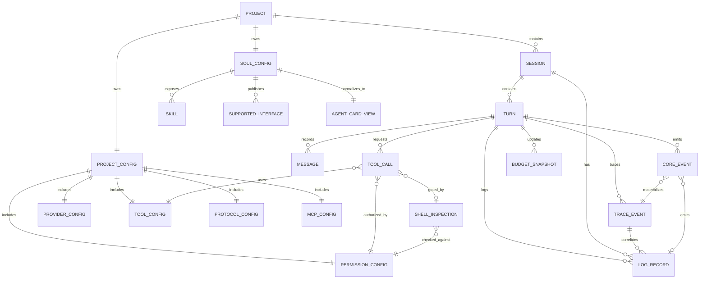
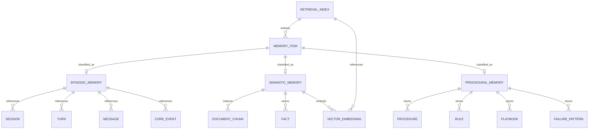
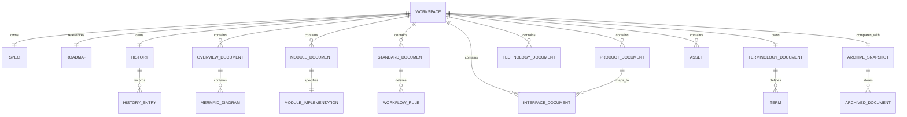

# Entity Relationship Diagrams

更新时间: 2026-06-04 22:10

## 定位

本文件使用 Markdown Mermaid ER 图描述 Alius v10 的核心实体关系。它用于补充架构图和数据流图，帮助实现阶段对齐存储模型、配置模型和运行时对象。

## Runtime Entities

## Memory Entities

## Workspace Document Entities

