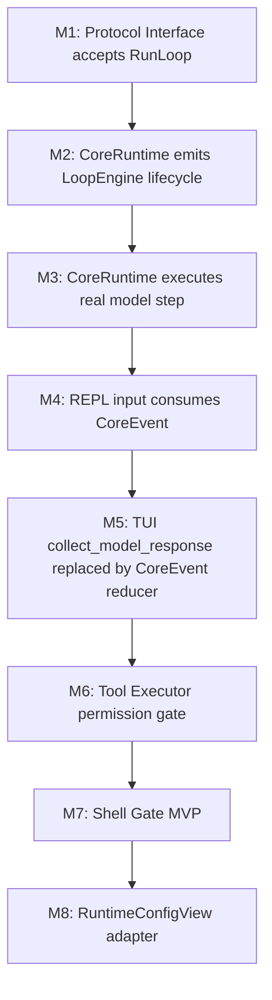

# H1 Execution Chain Remediation

更新时间: 2026-06-05 03:43

## 文档定位

本文记录 H1 阶段针对当前执行链路问题的纠偏方案。它不是新的长期 Roadmap，而是把当前发现的工程断裂点转化为可执行的研发边界和优先级。

目标是让 Alius 从“多个模块并存”收敛为“一条统一主链”:

```text
Product Layer
-> Protocol Interface Layer
-> Core Runtime
-> Session Manager
-> Loop Engine
-> Tool Executor / Memory / Model / Logging
```

## 当前核心问题

| 问题 | 当前表现 | 影响 |
| --- | --- | --- |
| Core Runtime 未真正承担主链职责 | `core-runtime::CoreRuntime::start` 只创建 session/run/event，并返回 stub final event | Core Runtime 名义存在，但不是统一执行层 |
| REPL/TUI 绕过 Loop Engine | `ReplSession::handle_input` 和 TUI `collect_model_response` 仍存在直接调用 `LlmClient.chat_stream` 的 legacy/default 路径 | 工具调用、权限、事件、日志、trace 无法进入统一主链 |
| 权限系统存在但未落实 | `PermissionManager` 和 `PermissionLevel` 存在，但 `AliusAgent::execute_tool` 直接执行工具 | write/shell/MCP/tool policy 无法统一强制执行 |
| Shell Gate 未形成强制门禁 | `ShellTool` 只检查少量字符串黑名单 | 无法覆盖 cwd、参数、glob、symlink、重定向和 workspace 外作用范围 |
| 配置 schema 并存 | `core-runtime/config/defaults/*.toml` 已拆分，但 `Settings::load` 仍主要服务 legacy/user/project settings | Core Runtime 缺少稳定 `RuntimeConfigView` |

## 根因判断

这些问题不是单点 bug，而是架构落地顺序造成的主链缺口:

```text
协议类型已定义
CoreRuntime 骨架已存在
SessionManager MVP 已存在
但真实模型执行仍停留在 Product Layer / ReplSession
```

因此 H1 不能优先扩展产品功能，也不能先做 A2A、Desktop、完整记忆系统。H1 必须先让 Core Runtime 拿回真实执行权。

## 修复原则

1. Product Layer 只负责输入、显示和产品交互，不直接调用 provider、tools、store 内部能力。
2. Protocol Interface Layer 负责 envelope、origin、capability、trace，不执行业务逻辑。
3. Core Runtime 必须拥有 turn lifecycle、Loop Engine、event stream、logging context 和 tool policy 入口。
4. 工具调用只能通过 Tool Executor，不能由 Agent 直接调用具体工具。
5. Shell/process/git 工具必须先经过 Shell Gate，再进入本地 OS。
6. Config Manager 输出稳定 RuntimeConfigView，Core Runtime 不直接拼接零散配置来源。

## H1 修复顺序

### H1.1 Core Runtime 承接统一 Loop Engine

目标:

- `CoreRuntime::start` 只接受协议层归一化后的 `CoreRequest::RunLoop` 作为新主路径。
- Core Runtime 能从 `RunLoopInput` 提取用户输入、`RuntimeMode` 和 `LoopPolicy`。
- Core Runtime 调用 Loop Engine；Loop Engine 后续接入真实模型、工具、记忆和审批。
- AgentEvent 统一映射为 CoreEvent。

实施方式:

```text
ProtocolEnvelope<CoreRequest>
-> CoreRuntime::start
-> SessionManager create turn/run/trace
-> LoopEngine run
-> Model Step / Tool Step / Convergence Check
-> EventAdapter map internal events -> CoreEvent
-> SessionManager persist events
-> CoreEvent stream
```

验收:

- Core Runtime 事件中出现真实 `ModelDelta` / `FinalResult`。
- 每次 loop 至少产生一次 `CoreEvent::ConvergenceChecked`。
- 真实模型错误映射为 `ErrorRaised`。
- 不再出现 stub final event 作为真实模型主路径结果。

### H1.2 REPL / TUI 改成 Core consumer

目标:

- `ReplSession::handle_input` 不直接调用 `LlmClient.chat_stream`。
- TUI `collect_model_response` 不直接调用 `LlmClient.chat_stream`。
- CLI/TUI 只构造 `ProtocolEnvelope<CoreRequest>`，然后消费 `CoreEvent`。

实施方式:

```text
REPL input
-> ReplMode
-> LoopPolicy
-> CoreRequest::RunLoop
-> ProtocolEnvelope<CoreRequest>
-> CoreRuntimeApi::start
-> CoreRuntimeApi::subscribe
-> render CoreEvent
```

验收:

- `rg "chat_stream" entrypoints/cli/src` 不再命中默认用户输入路径。
- TUI 使用 CoreEvent reducer 生成 ConversationBlock。
- legacy fallback 如需保留，必须显式标注并由环境变量或 feature 开关控制。

### H1.3 Tool Executor 成为唯一工具执行入口

目标:

- `AliusAgent::execute_tool` 不直接执行工具。
- 新增或改造 Tool Executor，统一执行:

```text
tool call
-> permission check
-> optional Shell Gate
-> confirmation
-> tool.execute
-> ToolEvent / CoreEvent
```

验收:

- 每个工具调用前都有 policy decision。
- write/delete/shell/network 工具不能绕过 permission。
- 工具执行结果能映射为 `ToolCallCompleted` 或 `ErrorRaised`。

### H1.4 Shell Gate MVP 强制接入

目标:

- ShellTool 不再依赖局部字符串黑名单作为主要安全边界。
- Shell/process/git 调用必须先经过 Shell Gate。

最低检查:

- command name。
- cwd 是否在 workspace 内。
- 参数是否包含绝对路径或 `..` 越界。
- destructive command。
- redirection。
- shell eval: `sh -c`、`bash -c`、管道、通配符。

验收:

- `rm -rf /`、`rm -rf ~`、`rm -rf .`、`rm -rf *` 默认拒绝。
- workspace 外读写默认拒绝或 approval required。
- RemoteA2A 和 EmbeddedSdk 默认不能使用 shell。

### H1.5 RuntimeConfigView 适配层

目标:

- Core Runtime 不直接读 legacy `Settings`。
- Config Manager 负责合并 defaults、user config、project config、env、CLI override。
- 输出稳定 runtime view:

```text
RuntimeConfigView {
  provider,
  model_router,
  tools,
  permissions,
  protocol,
  soul,
  logging,
  workspace
}
```

验收:

- `.alius/config/*.toml` 和 `.alius/config/mcp.json` 是项目配置主来源。
- legacy `.alius/config.toml` 只作为兼容读取或迁移来源。
- `config_validate` 能报告 schema 缺失、类型错误和冲突。

## 不建议的实现顺序

| 做法 | 为什么不建议 |
| --- | --- |
| 先把 REPL/TUI 完全切到当前 CoreRuntime stub | 会让真实模型能力退化成 stub 输出；当前只能先建立 RunLoop 契约和结构 |
| 先扩展 A2A | 会把不稳定的本地主链暴露给远端协议 |
| 先做完整记忆系统 | 记忆写入和召回需要 stable session/run/trace |
| 只在 ShellTool 内加更多黑名单 | 解决不了工具统一权限和作用范围问题 |
| 直接重写 Settings | 风险大，容易破坏 init/config/model 现有流程 |

## 最小可执行里程碑



## 第一优先级

第一优先级是 **H1.1 Core Runtime 承接统一 Loop Engine**。

原因:

- 不先修这个，REPL/TUI 切换到 Core 只会切到 stub。
- 权限、日志、trace、memory 都需要 Core Runtime 成为真实执行主链后才有统一落点。
- 这是后续所有产品入口一致性的前提。

## 研发任务拆分建议

| Task | 目标文件 | 交付 |
| --- | --- | --- |
| H1-0 | `protocol/src/core.rs`、`protocol/` | Protocol Interface 支持 `CoreRequest::RunLoop` |
| H1-1 | `runtime/core/src/loop_engine/`、`runtime/core/src/runtime.rs` | CoreRuntime 通过 LoopEngine 执行 RunLoop |
| H1-2 | `runtime/core/src/loop_engine/model_step.rs`、`runtime/core/src/event_adapter.rs` | 接入真实模型输出并映射 CoreEvent |
| H1-3 | `entrypoints/cli/src/repl/` | REPL 默认输入改走 CoreRuntime |
| H1-4 | `entrypoints/cli/src/tui/workspace/mod.rs` | TUI 改为 CoreEvent consumer |
| H1-5 | `entrypoints/cli/src/tools/`、`runtime/core/` | Tool Executor permission gate |
| H1-6 | `entrypoints/cli/src/tools/builtin/shell.rs`、Shell Gate 模块 | shell/process/git 强制门禁 |
| H1-7 | `runtime/core/src/config.rs`、`entrypoints/cli/src/config/` | RuntimeConfigView adapter |

## 成功标准

- 默认 CLI/TUI 用户输入不再直接调用 provider。
- CoreRuntime 是唯一真实 turn 执行入口。
- Loop Engine、Tool Executor、Shell Gate、Logging、SessionManager 都位于同一条主链。
- 配置读取进入稳定 RuntimeConfigView。
- 每个高风险能力都有 policy decision 和可查询 trace。
