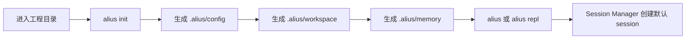
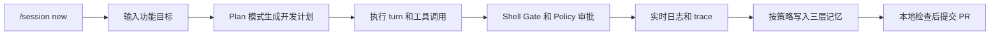
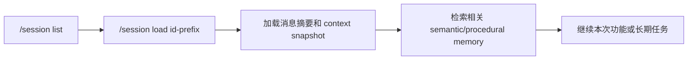

# Alius CLI Product Design

更新时间: 2026-06-05 13:42

## 产品定位

Alius CLI 是当前工程的主产品。它在一个指定工作区中运行，面向开发者提供命令行、REPL 和 TUI 形式的 AI Agent Runtime Workspace。

工作区定义:

- 一个 workspace 对应一个确定的工程目录。
- 一个 workspace 只管理一个工程。
- CLI 的 `--workspace` 或当前目录用于确定该工程范围。

Session 定义:

- 一个 session 对应一次开发轮次、一个功能开发过程、一次修复过程或一个长期任务。
- 同一 workspace 下可以有多个 session。
- Session 用于恢复上下文、查看历史、挂接 memory、记录 trace 和区分第 N 次开发。

## 目标用户和市场定位

| 维度 | 定位 |
| --- | --- |
| 目标用户 | 本地工程开发者、AI 辅助编码用户、需要可审计工作流的团队 |
| 使用场景 | 项目初始化、功能开发、代码检查、文档驱动开发、工作区记忆管理、Agent 协作准备 |
| 市场边界 | 本地优先的工程 Agent CLI，不是云 IDE，不是 Desktop 产品，不是纯聊天机器人 |
| 关键价值 | 在确定工程目录内提供可恢复、可审计、可配置、可门禁的 Agent 开发流程 |

## 命令入口

全局参数:

| 参数 | 作用 | 注意事项 |
| --- | --- | --- |
| `--model <model>` | 覆盖默认模型 | 仅影响当前命令或运行上下文 |
| `--provider <provider>` | 覆盖默认 provider | 可选值由配置和 provider 实现决定 |
| `--workspace <path>` | 指定工作区目录 | 作用范围必须限制在该目录对应工程内 |
| `--config <path>` | 指定用户配置文件 | 不替代项目 `.alius/config/` 规范 |
| `-v`, `-vv`, `-vvv` | 日志详细级别 | 对应 info、debug、trace 级别 |

基础命令:

| 命令 | 作用 | 操作设计 | 注意事项 |
| --- | --- | --- | --- |
| `alius` | 进入默认交互工作区 | 启动 REPL/TUI，加载配置，打开或创建 session | 必须经 Direct Rust API 进入协议接口层 |
| `alius repl` | 显式进入交互模式 | 与无子命令一致 | 用于脚本或文档中明确表达交互入口 |
| `alius run --prompt <text>` | 单次非交互调用 | 读取配置，调用模型，打印结果 | 当前实现路径仍需重构为 Core Runtime 主路径 |
| `alius run -p <text> --model <model>` | 单次调用并覆盖模型 | 只覆盖本次 run 的模型 | 不能修改持久配置 |
| `alius init` | 初始化项目配置 | 启动配置向导，创建或更新 `.alius/config/` | 新规范要求创建 config、memory、workspace 三大目录 |
| `alius config show` | 显示合并配置摘要 | 展示 provider、model、soul 等 | 不能泄露密钥明文 |
| `alius config validate` | 校验配置完整性 | 检查 provider、model、API key、soul 等 | 不通过时提示运行 init 或修复配置 |
| `alius config soul --role <role>` | 安装并激活 role/soul | 写入当前项目 Agent 身份 | 新规范落到 `.alius/config/soul.toml` |
| `alius version` | 显示版本 | 输出 `alius <version>` | 版本来自构建环境 |

Soul 和 Agent Card 相关命令:

| 命令 | 作用 | 注意事项 |
| --- | --- | --- |
| `alius soul update` | 同步官方 souls 到本地缓存 | 用于安装前刷新 |
| `alius soul list` | 列出本地已安装 souls | 标记当前 active soul |
| `alius soul install <id>` | 安装指定 soul | 源来自官方 soul 仓库 |
| `alius soul current` | 查看当前项目 active soul | 新规范映射到 `soul.toml` |
| `alius soul remove <id>` | 移除本地 soul | 不应删除项目历史 session |
| `alius core update` | 更新官方 soul 仓库 | 兼容命令，后续命名需与 Soul 文档统一 |
| `alius core list` | 列出官方仓库可用 souls | 只读操作 |
| `alius core info <id>` | 查看 soul 详情 | 只读操作 |

扩展能力命令:

| 命令 | 作用 | 门禁要求 |
| --- | --- | --- |
| `alius plugin list` | 列出已安装插件 | 只读 |
| `alius plugin install <path>` | 安装本地插件 | 路径不得越权，需校验 manifest 和 wasm |
| `alius plugin info <id>` | 查看插件详情 | 只读 |
| `alius plugin remove <id>` | 移除插件 | 高影响操作需确认 |
| `alius mcp list` | 列出配置的 MCP servers | 读取 `.alius/config/mcp.json` |
| `alius mcp start <name>` | 启动 MCP server 并列出工具 | 需要进程启动权限 |
| `alius mcp tools <name>` | 列出某 MCP server 工具 | 需要进程启动权限 |
| `alius workflow list` | 列出 workflow | 只读 |
| `alius workflow run <name-or-path>` | 执行 workflow | 每个步骤仍需遵守工具和 Shell 门禁 |
| `alius workflow validate <path>` | 校验 workflow 文件 | 只读 |

## 交互内命令

REPL/TUI 内部命令:

| 命令 | 作用 | 用户流程 |
| --- | --- | --- |
| `/help` | 查看帮助 | 用户不知道命令时进入 |
| `/init` | 显示初始化确认菜单 | 输入区显示"是/否"决策菜单；选择"是"重置配置并启动向导，选择"否"取消 |
| `/mode` | 查看当前 REPL 模式 | 显示 `chat` 或 `plan` |
| `/mode chat` | 切换普通聊天模式 | 使用 Loop Engine + ChatPolicy，固定一轮、默认关闭工具 |
| `/mode plan` | 切换 Plan 模式 | 使用 Loop Engine + PlanPolicy，多轮执行、允许工具和收敛判断 |
| `/config` | 打开配置面板 | 修改 provider、base URL、API key、model、soul、语言 |
| `/config show` | 查看当前配置 | 诊断配置来源 |
| `/model` | 打开模型选择 | 交互选择模型 |
| `/model <name>` | 直接切换模型 | 当前 session 后续 turn 使用新模型 |
| `/session current` | 查看当前 session | 展示 session id、模型和消息数 |
| `/session new` | 新建开发轮次 | 开始新功能或长期任务 |
| `/session list` | 列出历史 sessions | 恢复之前开发轮次 |
| `/session load <id-prefix>` | 加载历史 session | 可用短 id 前缀 |
| `/session clear` | 清空当前会话消息 | 不应删除 session 元数据 |
| `/history` | 查看当前 session 消息摘要 | 诊断上下文 |
| `/review` | 复查上一条 assistant 输出 | 使用 review model 或默认模型 |
| `/review auto on` | 开启自动 review | 每次响应后自动复查 |
| `/review auto off` | 关闭自动 review | 恢复普通模式 |
| `/memory save <text>` | 保存记忆 | 当前实现写入 legacy memory，v10 需映射到三层记忆 |
| `/memory list` 或 `/memory show` | 查看记忆 | 读取全局和项目记忆 |
| `/memory clear` | 清空全局记忆 | 高影响操作需确认 |
| `/doctor` | 运行诊断 | 检查配置、soul、MCP、plugin、workflow 等 |
| `/tools` | 查看可用工具 | 后续应展示能力范围和审批要求 |
| `/clear` | 清屏或清当前输入上下文 | 不应删除持久记忆 |
| `/quit`, `/exit` | 退出交互模式 | 退出前应 flush 日志和 session 状态 |

快捷键设计:

| 快捷键 | 作用 |
| --- | --- |
| `Ctrl+Tab` | 切换主标签页 |
| `Shift+Tab` | 在 Chat / Plan 模式之间切换；不同终端不支持时使用 `/mode chat` 或 `/mode plan` |
| `Tab` | 输入框内容以 `/` 开头时补全命令或子命令；其他情况下在输入、Conversation、Plans 焦点区之间移动 |
| `Ctrl+Enter` | 提交当前输入 |
| `Enter` | 输入非空时提交 |
| `Esc` | 清空当前输入或取消当前局部操作 |
| `Ctrl+C`, `Ctrl+D` | 退出交互工作区 |
| `Up`, `Down`, `PageUp`, `PageDown`, `Home`, `End` | 滚动当前焦点面板 |

## REPL 模式

REPL 不再设计为 `/chat` 和 `/agent` 两条执行路径，而是统一进入 Loop Engine:

```text
Chat Mode = Loop Engine + ChatPolicy
Plan Mode = Loop Engine + PlanPolicy
```

提示符格式:

```text
Alius[chat] gpt-4o-mini >
Alius[plan] gpt-4o-mini >
```

废弃入口:

- `/chat`: 不作为新入口。
- `/agent`: 不作为新入口。
- `/auto`: 不引入自动判断。

## 用户设计流程

### 流程一: 首次进入工程



### 流程二: 一个功能开发 Session



### 流程三: 恢复第 N 次开发



## 接口边界

| 边界 | 要求 |
| --- | --- |
| CLI -> Protocol Interface Layer | 默认通过 Direct Rust API。即便同进程，也必须构造 ProtocolEnvelope。 |
| Protocol Interface Layer -> Core Runtime | 只能进入 Core Public API。 |
| CLI -> Shell | 必须通过 Tool Executor、Shell Gate、Security Policy。 |
| CLI -> Memory | 通过 Session Manager、Memory Manager 和 Retrieval Engine，不能直接写最终三层存储。 |
| CLI -> A2A | 只能通过配置或命令开关启用，不是默认路径。 |

## 注意事项

- CLI 的默认安全范围是当前 workspace。读写超出 workspace 的文件必须授权。
- `rm -rf`、递归删除根路径、清空 workspace 等高风险命令默认拒绝或强制审批。
- RemoteA2A 不能继承 CLI 的本地文件、shell、git 权限。
- 交互界面里的 Agent Team 只能在 A2A 真正接通后描述为可用能力。
- `ROADMAP.md` 不是实现依据，最新 workspace docs 才是实现依据。

## 验收标准

- 所有 CLI 命令在文档中有定位、作用和权限说明。
- 一次 CLI turn 可映射到 `ProtocolEnvelope<CoreRequest>`。
- Session 的创建、恢复、清理、历史查询可被 Session Manager 表达。
- Shell 命令执行前必经 Shell Gate。
- 运行日志、错误日志和 trace 可按 session/run 查询。
