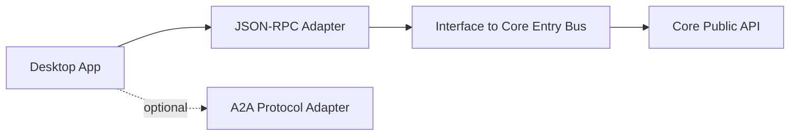

# Desktop Product Planning

更新时间: 2026-06-04 22:10

## 产品定位

Desktop 是未来规划产品。本工程不实现 Desktop 产品本体，只保留与 Desktop 相关的接口规划、协议边界和 Core Runtime 接入准备。

## 目标用户和市场定位

| 维度 | 定位 |
| --- | --- |
| 目标用户 | 偏好图形界面的开发者、项目负责人、需要可视化 session 和 memory 的用户 |
| 市场边界 | 独立桌面产品，不是当前仓库交付范围 |
| 关键价值 | 图形化管理 workspace、session、approval、trace、memory 和 Agent 协作 |

## 技术候选

| 候选 | 状态 | 备注 |
| --- | --- | --- |
| Electron | 架构图当前记录的规划方向 | 通过 JSON-RPC Adapter 接入 |
| Tauri | 待确认候选 | 用户提到的 `Tears` 暂按待确认桌面技术候选记录 |

## 接入接口

## 规划能力

- Workspace 选择和当前工程确认。
- Session 列表、恢复和长期任务面板。
- Approval UI。
- Runtime logs 和 trace 可视化。
- Memory 检索、编辑和引用管理。
- A2A 开关和远端 Agent 管理。

## 不在当前工程实现的内容

- Desktop UI 页面。
- Electron/Tauri 应用壳。
- 安装包和自动更新。
- 系统托盘、窗口管理和原生通知。

## 注意事项

- Desktop 不能绕过协议接口层。
- Desktop 的本地文件和 shell 能力默认低于 LocalTui，需要显式授权。
- Desktop A2A 是规划可选能力，不是默认入口。

## 验收标准

- Workspace docs 中只把 Desktop 写成规划产品。
- JSON-RPC Adapter 的协议文档能满足未来 Desktop 调用。
- Desktop 相关能力不被误写成当前已实现产品能力。
