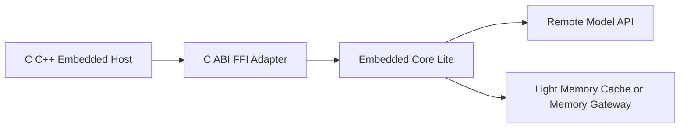
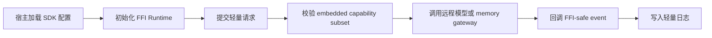

# Embedded Third Party SDK Product Design

更新时间: 2026-06-04 22:10

## 产品定位

嵌入式第三方 SDK 面向第三方宿主、嵌入式设备或轻量 UI 环境，提供 Alius Core 的裁剪能力。它不是完整 CLI，也不暴露本地桌面工具运行时。

## 目标用户和市场定位

| 维度 | 定位 |
| --- | --- |
| 目标用户 | 嵌入式应用开发者、第三方设备厂商、需要轻量 Agent 能力的宿主应用 |
| 示例环境 | ESP32 + LVGL、C/C++ 宿主、受限资源设备 |
| 市场边界 | 轻量 SDK，不是本地开发 Agent，不运行完整工具链 |
| 关键价值 | 在受限环境中复用配置、模型路由、远程推理和轻量记忆能力 |

## 使用方式

构建目标:

```text
cargo build --release --features embedded-sdk
```

产物目标:

```text
staticlib / cdylib
```

宿主调用路径:



## 接口设计

| 接口 | 作用 | 约束 |
| --- | --- | --- |
| `ffi_start(request)` | 启动一次 SDK run | payload 必须可解码，返回 FFI-safe run ref |
| `core_lite_run(request)` | 执行裁剪 Core 流程 | 输出 FFI-safe event/result |
| `core_lite_configure(config)` | 配置 provider、gateway、能力开关 | 不读取完整 CLI 配置 |
| `core_lite_cancel(run_ref)` | 取消运行中的任务 | 必须幂等 |

## 保留能力

- minimal config。
- provider/model routing 子集。
- remote model call。
- remote embedding 或 memory gateway。
- light memory cache。
- 受限日志和错误上报。

## 禁用能力

- 本地 shell。
- 本地文件改写。
- 本地 git/process 管理。
- heavy tools。
- LanceDB。
- 本地 embedding。
- plugin runtime。
- 默认 A2A。

## 用户设计流程



## 注意事项

- SDK 不应假设有文件系统、终端、shell 或 keychain。
- 配置必须支持宿主内存传入，不能强依赖 `.alius/config/`。
- 日志需要可回调给宿主，也需要支持宿主关闭本地持久化。
- 错误码必须稳定，避免跨语言异常泄漏。

## 验收标准

- `embedded-sdk` 构建不会拉入 heavy tools、LanceDB、local embedding、plugin runtime。
- FFI API 和错误码稳定。
- Core Lite 调用本地工具时被拒绝。
- 远程 model/memory gateway 不可用时返回可诊断错误。
