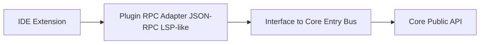

# IDE Extension Product Planning

更新时间: 2026-06-04 22:10

## 产品定位

IDE 插件是未来面向 VS Code、JetBrains 等编辑器的产品形态。它通过 Plugin RPC Adapter 进入协议接口层，不直接调用 Core Runtime 内部模块。

## 目标用户和市场定位

| 维度 | 定位 |
| --- | --- |
| 目标用户 | 希望在编辑器内使用 Alius 的开发者 |
| 使用场景 | 文件定位、代码修改、Review、计划执行、上下文引用 |
| 市场边界 | 编辑器内 Agent 入口，不替代 CLI 的工作区管理能力 |

## 接口方式

## 规划能力

- 当前 workspace 识别。
- 当前文件、选区、diagnostics 注入到 CoreRequest。
- Plan、Review、Apply Patch 等 workflow 入口。
- Approval UI 与 IDE 权限模型联动。
- CoreEvent stream 渲染到 IDE 面板。

## 权限边界

- 默认只允许 workspace-scoped 文件读写。
- shell/process 能力默认关闭或强制审批。
- IDE diagnostics 可作为上下文输入，但不能绕过用户授权修改文件。

## 验收标准

- IDE 入口只通过 Plugin RPC Adapter。
- CoreRequest 可表达文件、选区、diagnostics。
- 所有文件写入受 Shell Gate / Security Policy 的路径范围规则约束。
