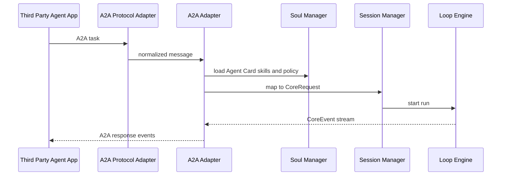

# Third Party Agent App Product Design

更新时间: 2026-06-05 03:43

## 产品定位

第三方 Agent 应用通过 A2A 协议与 Alius 协作。它是外部 Agent 或外部应用接入 Alius Core 的协议入口，不是本地 CLI 权限的延伸。

## 目标用户和市场定位

| 维度 | 定位 |
| --- | --- |
| 目标用户 | 其他 Agent 平台、自动化系统、企业内部协作 Agent |
| 使用场景 | 远端任务委派、状态查询、跨 Agent 协作、结果流式返回 |
| 市场边界 | 协议级 Agent 协作入口，不提供本地 shell 或文件系统默认权限 |

## Agent Card 来源

项目内源配置:

```text
.alius/config/soul.toml
```

发布导出:

```text
.well-known/agent-card.json
```

`soul.toml` 保留 name、description、provider、capabilities、skills、default input/output modes，以及发布后才能确定的 URL 字段。

## 接入流程



## 默认权限

| 能力 | 默认策略 |
| --- | --- |
| 本地文件读取 | 禁止 |
| 本地文件写入 | 禁止 |
| shell/process | 禁止 |
| MCP 工具 | 需要按 skill 和 policy 显式授权 |
| 模型调用 | 可按 provider 和 budget 策略允许 |
| 结果流式返回 | 可允许 |

## 注意事项

- RemoteA2A 不能继承 LocalTui 的本地权限。
- 远端 task 必须绑定 origin、capability_scope 和 trace_id。
- A2A Adapter 只做协议映射，不绕过 Session Manager。

## 验收标准

- Agent Card 可从 `soul.toml` 导出。
- A2A task 可映射为 CoreRequest。
- 远端请求默认无本地文件和 shell 权限。
- A2A 事件可映射回协议响应。
