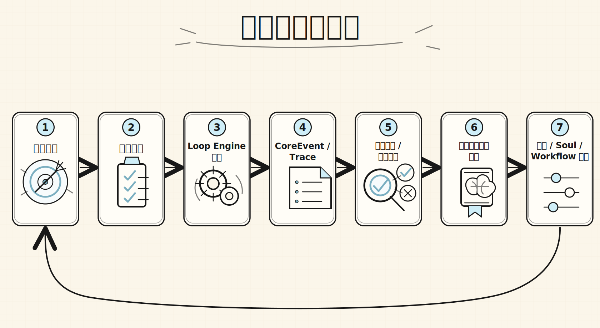
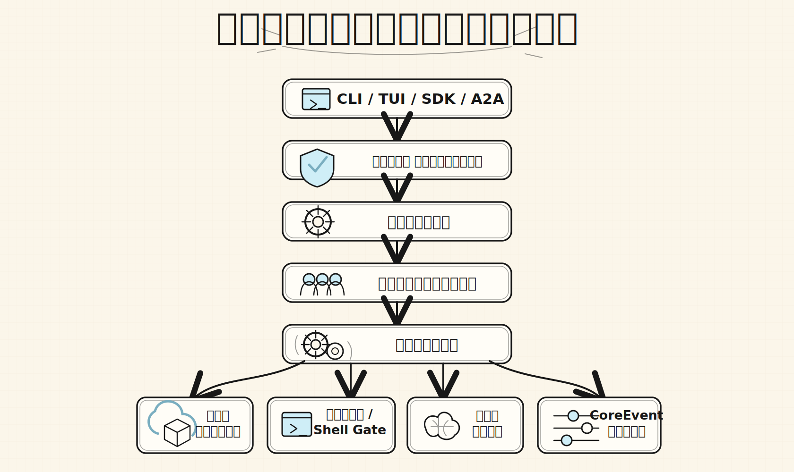

# Alius

<p align="center">
  <strong>計画でき、実行でき、追跡でき、自己進化するエンジニアリングワークスペースへ。</strong>
</p>

<p align="center">
  <a href="https://github.com/AliusTech/alius/releases/latest"></a>
  <a href="https://www.npmjs.com/package/@alius-tech/alius"></a>
  <a href="https://github.com/AliusTech/homebrew-tap"></a>
</p>

<p align="center">
  <a href="./README.md" aria-label="English">🇺🇸</a>
  &nbsp;&nbsp;
  <a href="./README.cn.md" aria-label="简体中文">🇨🇳</a>
  &nbsp;&nbsp;
  <a href="./README.ja.md" aria-label="日本語">🇯🇵</a>
</p>

Alius はローカルファーストの AI Agent Runtime Workspace です。開発意図を、再開可能な Session、観測可能な Run、監査可能な CoreEvent stream に変換し、設定、記憶、計画、意思決定を同じエンジニアリングワークスペースに蓄積します。

これはターミナルで包んだチャットボットではありません。Alius は、ソフトウェアが自身の進化に参加するための基盤です。目標を理解し、計画を作り、制御されたランタイム境界を通じて実行し、証拠を記録し、結果をレビューし、次のイテレーションへ学習を持ち越します。

## Why Alius

| 従来の AI CLI | Alius |
| --- | --- |
| 会話を中心に作業を組み立てる | 実際のプロジェクト Workspace を中心に作業を組み立てる |
| 人間が解釈するためのテキストを返す | Plans、Runs、Traces、再開可能なコンテキストを生成する |
| 設定がユーザーマシン上に散在する | プロジェクト設定、記憶、ワークスペース文書を `.alius/` に保存する |
| モデル選択を製品側の前提にする | Provider、Base URL、Model、API Key、Soul をユーザーが設定できる |
| ツール実行が不透明になりやすい | Protocol、Runtime、Policy、Shell Gate で境界を作る |

## Self-Evolving Loop

Alius はひとつの考え方を中心に設計されています。プロジェクトは、自身の開発プロセスを継続的に吸収するべきです。

<p align="center">
  
</p>

すべてのイテレーションは構造化された証拠を残すべきです。何を変更したのか、なぜ変更したのか、どの能力を使ったのか、どの判断にレビューが必要だったのか、どの学びを記憶として残すべきなのか。次の進化は、空のプロンプトから始まるべきではありません。

## Engineering Main Chain

Alius はプロダクトサーフェスをランタイムチェーンの背後に置きます。CLI、TUI、SDK、将来の A2A エントリーポイントは、すべて Protocol Interface を通って Core Runtime に入ります。

<p align="center">
  
</p>

この主鎖によって、体験、プロトコル境界、実行、ツール、記憶、イベントトレースをひとつのエンジニアリングモデルに収められます。孤立したコマンド群に機能を積み上げる設計ではありません。

## Install

最新 release を直接インストールします。

```bash
curl -fsSL https://raw.githubusercontent.com/AliusTech/alius/main/scripts/install/install.sh | sh
```

Windows PowerShell:

```powershell
irm https://raw.githubusercontent.com/AliusTech/alius/main/scripts/install/install.ps1 | iex
```

パッケージマネージャーでもインストールできます。

```bash
npm install -g @alius-tech/alius

brew tap AliusTech/tap
brew install alius
```

Homebrew がない環境では、release インストーラーまたは npm を使ってください。Alius は Homebrew に依存しません。

インストール確認:

```bash
alius --version
```

## Quick Start

現在のプロジェクトを初期化します。

```bash
alius init
```

Agent Runtime Workspace に入ります。

```bash
alius
```

単発リクエストを実行します。

```bash
alius run -p "このモジュールを構造化コードレビューして"
```

## Workspace Experience

Alius のインタラクション層は、チャット相手ではなくワークフローを中心に構成されています。

- `Chat Mode`: 単発の目標確認、説明、調査、軽量実行。
- `Plan Mode`: 複数ステップの計画、ツール実行、レビュー、収束判断。
- `Session`: 機能開発、バグ修正、レビュー、長期タスクの再開可能なコンテキスト。
- `Plans`: 現在の計画ノード、状態、次の実行ポイント。
- `Memory`: プロジェクト事実、意思決定、学習、再利用可能な手順。

よく使うワークスペース入口:

```bash
/init
/mode plan
/config
/model
/session new
/memory save <text>
/review
/tools
```

重要なのはコマンドそのものではありません。目標から計画へ、計画から実行へ、実行から証拠へ、証拠から次の進化へ進むワークフローです。

## Configurable Model Runtime

Alius はモデル一覧を製品ストーリーに固定しません。Provider、Base URL、Model、API Key、project Soul はランタイム設定です。

プロジェクト設定は現在のワークスペースに保存されます。

```text
.alius/
├── config/
│   ├── config.toml
│   ├── providers.toml
│   ├── soul.toml
│   ├── tools.toml
│   ├── permissions.toml
│   ├── protocol.toml
│   └── mcp.json
├── memory/
└── workspace/
```

これにより、Alius はデフォルト provider、互換エンドポイント、ローカルゲートウェイ、チームプロキシサービスに接続できます。モデルはランタイムの選択であり、製品の境界ではありません。

## Built for Real Engineering

Alius が現在フォーカスしている境界は明確です。ローカルプロジェクトワークスペース内で、再開可能、監査可能、設定可能、ゲート付きの Agent 開発フローを提供します。

| Capability | Design intent |
| --- | --- |
| Workspace | AI 作業を具体的なプロジェクト範囲に閉じ込める |
| Session / Run / Trace | 開発ラウンド、実行インスタンス、診断チェーンを復旧可能にする |
| Protocol Interface | CLI、TUI、SDK、A2A に同じ request、command、event セマンティクスを与える |
| Loop Engine | Chat Mode と Plan Mode をひとつの実行エンジンで扱う |
| Shell Gate | shell、process、git など高リスク操作にポリシーチェックを加える |
| Memory System | プロジェクト事実、経験、手順を長期コンテキストに変換する |

## Current Maturity

Alius にはすでに CLI/TUI プロダクトサーフェス、プロジェクト初期化、設定ウィザード、Session ベースライン、Protocol Interface、Core Runtime、Loop Engine、初期のツール/記憶エントリがあります。

次の主要な作業は、構造化 logging、階層化 memory、CoreEvent 駆動の TUI reducer、Shell Gate ポリシー実行をデフォルトパスでさらに深くすることです。
