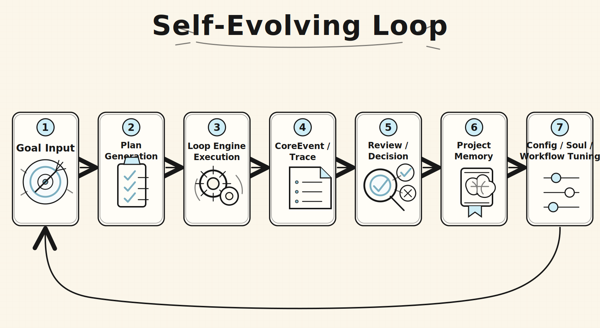
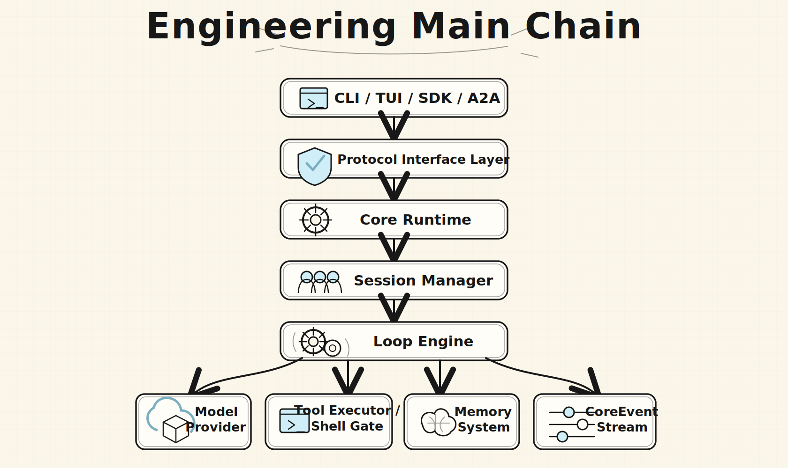

# Alius

<p align="center">
  <strong>Enter a plannable, executable, traceable, self-evolving engineering workspace.</strong>
</p>

<p align="center">
  <a href="https://github.com/AliusTech/alius/releases/latest"></a>
  <a href="https://www.npmjs.com/package/@alius-tech/alius"></a>
  <a href="https://github.com/AliusTech/homebrew-tap"></a>
</p>

<p align="center">
  <a href="./README.md" aria-label="English">🇺🇸</a>
  &nbsp;&nbsp;
  <a href="./README.cn.md" aria-label="简体中文">🇨🇳</a>
  &nbsp;&nbsp;
  <a href="./README.ja.md" aria-label="日本語">🇯🇵</a>
</p>

Alius is a local-first AI Agent Runtime Workspace. It turns development intent into resumable Sessions, observable Runs, auditable CoreEvent streams, and project memory stored inside the same engineering workspace.

It is not a chatbot wrapped in a terminal. Alius is built for software that can participate in its own evolution: understand the target, produce a plan, execute through controlled runtime boundaries, record evidence, review the result, and carry the learning into the next iteration.

## Why Alius

| Traditional AI CLI | Alius |
| --- | --- |
| Organizes work around a conversation | Organizes work around a real project workspace |
| Returns text for humans to interpret | Produces Plans, Runs, Traces, and resumable context |
| Scatters configuration across user machines | Stores project config, memory, and workspace docs under `.alius/` |
| Treats model choice as a product assumption | Lets users configure Provider, Base URL, Model, API Key, and Soul |
| Makes tool execution feel opaque | Routes work through Protocol, Runtime, Policy, and Shell Gate boundaries |

## Self-Evolving Loop

Alius is designed around one idea: a project should absorb its own development process.

<p align="center">
  
</p>

Every iteration should leave structured evidence: what changed, why it changed, which capabilities were used, which decisions required review, and which lessons should become reusable memory. The next evolution should not begin from an empty prompt.

## Engineering Main Chain

Alius keeps the product surface behind a runtime chain. CLI, TUI, SDK, and future A2A entry points all move through the Protocol Interface into Core Runtime.

<p align="center">
  
</p>

This chain lets Alius place experience, protocol boundaries, execution, tools, memory, and event traces in one engineering model instead of piling features onto isolated commands.

## Install

Install the latest release directly:

```bash
curl -fsSL https://raw.githubusercontent.com/AliusTech/alius/main/scripts/install/install.sh | sh
```

Windows PowerShell:

```powershell
irm https://raw.githubusercontent.com/AliusTech/alius/main/scripts/install/install.ps1 | iex
```

Package manager alternatives:

```bash
npm install -g @alius-tech/alius

brew tap AliusTech/tap
brew install alius
```

If Homebrew is not installed, use the release installer or npm. Alius does not require Homebrew.

Verify the installed binary:

```bash
alius --version
```

## Quick Start

Initialize the current project:

```bash
alius init
```

Enter the Agent Runtime Workspace:

```bash
alius
```

Run a one-off request:

```bash
alius run -p "Perform a structured code review of this module"
```

## Workspace Experience

Alius is organized around workflows, not chat personas.

- `Chat Mode`: single-turn clarification, explanation, lookup, and lightweight execution.
- `Plan Mode`: multi-step planning, tool execution, review, and convergence.
- `Session`: resumable context for a feature, bugfix, review, or long-running task.
- `Plans`: active plan nodes, status, and next execution points.
- `Memory`: project facts, decisions, lessons, and reusable procedures.

Common workspace entries:

```bash
/init
/mode plan
/config
/model
/session new
/memory save <text>
/review
/tools
```

The commands are not the point. The point is the workflow behind them: goal to plan, plan to execution, execution to evidence, evidence to the next evolution.

## Configurable Model Runtime

Alius does not hardcode a model list into the product story. Provider, Base URL, Model, API Key, and project Soul are runtime configuration.

Project configuration lives in the current workspace:

```text
.alius/
├── config/
│   ├── config.toml
│   ├── providers.toml
│   ├── soul.toml
│   ├── tools.toml
│   ├── permissions.toml
│   ├── protocol.toml
│   └── mcp.json
├── memory/
└── workspace/
```

That means Alius can connect to default providers, compatible endpoints, local gateways, or team proxy services. The model is a runtime choice, not the boundary of the product.

## Built for Real Engineering

Alius currently focuses on one clear boundary: a local project workspace with resumable, auditable, configurable, and gated agent development flows.

| Capability | Design intent |
| --- | --- |
| Workspace | Keep AI work inside a concrete project scope |
| Session / Run / Trace | Make development rounds, execution instances, and diagnostic chains recoverable |
| Protocol Interface | Give CLI, TUI, SDK, and A2A the same request, command, and event semantics |
| Loop Engine | Carry Chat Mode and Plan Mode through one execution engine |
| Shell Gate | Add policy checks for high-risk shell, process, and git operations |
| Memory System | Turn project facts, experience, and procedures into long-term context |

## Current Maturity

Alius already includes the CLI/TUI product surface, project initialization, configuration panel, Session baseline, Protocol Interface, Core Runtime, Loop Engine, and early tool/memory entries.

The next major work is making structured logging, layered memory, CoreEvent-driven TUI reduction, and Shell Gate policy enforcement deeper in the default path.

## Development

```bash
# Clone and build
git clone git@github.com:AliusTech/alius.git
cd alius
cargo build

# Enable commit message template (shows Conventional Commits hints on every git commit)
git config commit.template .gitmessage
```

All commits must follow [Conventional Commits](.alius/workspace/docs/standards/CONVENTIONAL_COMMITS.md).
Run `git config commit.template .gitmessage` once to get inline hints on every commit.

## Release

详见 [CHANGELOG.md](CHANGELOG.md) 获取版本更新记录和发布历史。

Releases 由 [release-pleaser](https://github.com/googleapis/release-please) 自动管理，参见 [Release Process](docs/RELEASE_PROCESS.md) 了解完整的自动化发布流程。

当前版本：v0.1.0（开发中）

### 安装最新版

```bash
# 安装最新 release
npm install -g @alius-tech/alius@latest

# 或使用 release 安装脚本
curl -fsSL https://raw.githubusercontent.com/AliusTech/alius/main/scripts/install/install.sh | sh
```

### 获取开发版本

```bash
# Clone 并构建开发版本
git clone https://github.com/AliusTech/alius.git
cd alius
cargo build

# 运行构建的二进制
./target/release/alius --version
```

### 发布流程

Alius 使用自动化发布流程：

1. **提交功能** → master 分支
2. **自动分析** → release-pleaser 分析 commits
3. **创建 PR** → 自动创建版本更新 PR
4. **合并 PR** → 自动创建 GitHub Release

版本号遵循 [Semantic Versioning](https://semver.org/)，根据 commit 类型自动决定：
- `feat:` → Minor 版本 (0.1.0 → 0.2.0)
- `fix:` → Patch 版本 (0.1.0 → 0.1.1)
- `BREAKING CHANGE:` → Major 版本 (0.1.0 → 1.0.0)
